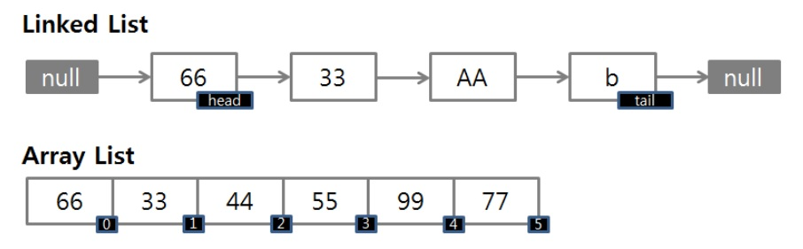
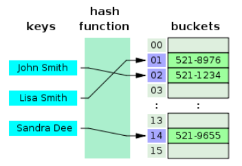
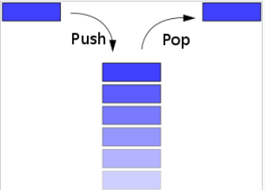
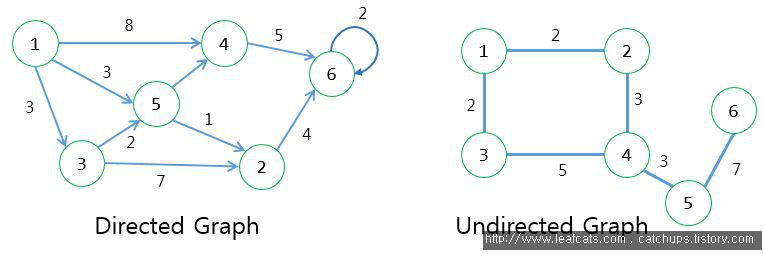
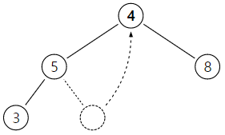

-----
 ## 진우 

 ### 💡 Array  
  #### 1. Array 란?  
  - 연관된 데이터를 하나의 변수에 그룹핑하여 관리하기 위한 자료구조입니다.
  - 1차, 2차, 3차 배열 모두 데이터 구조에 속합니다. 
  - 배열은 고정된 크기를 가지도록 선언/초기화 할 수 있으며 배열 바깥 범위를 액세스하는 경우 인덱스 초과 런타임 오류가 발생합니다.
  <br>

  #### 2. 장단점  
  - 장점 : 배열은 순차탐색, 인덱스를 통한 빠른 랜덤액세스가 가능합니다.
  - 단점 : 고정된 크기를 동적으로 바꿀 수 없습니다. 데이터가 인덱스로 고정되어 삽입, 삭제가 비효율적입니다.
  <br/>
  
  #### 3. 사용 예  
  - 학생들의 점수 저장, 전화번호부, 지도를 기반으로 한 알고리즘 문제 풀이 등등
  
  <br>
  
  #### 4. 시간 복잡도  
  - 순차탐색 : O(N)
  - 랜덤액세스 : O(1)
  - 삽입, 삭제  
  &nbsp;  메모리 효율을 위해 데이터를 미루고 당기는 경우 : O(N)   
  &nbsp;  속도를 위해 메모리를 낭비하는 경우 : O(1) -> 메모리에 빈 공간이 많이 발생하게 된다.

  <br>
  
  #### 5. 사용법 & ETC  
  
  Ex. 변수 A 에 스터디원의 이름을 담아보자
 
  |***A***|진우|가빈|윤아|아연|민영|
  |--|-|-|-|-|-|  
  
   -> 변수 A에 진우, 가빈, 윤아, 아연, 민영 순으로 담겼습니다.
 
  #### 그렇다면 배열로 각 사람들이 좋아하는 CS 과목을 함께 묶어서 저장할 수는 없을까??  
 
  |***A***|진우|가빈|윤아|아연|민영|
  |--|:-:|:-:|:-:|:-:|:-:|
  |  |OS|DB|AI|Network|Data Structure|
  
  다음과 같은 데이터 구조를 저장하는 Java 기준 소스
  
  ```
    String[][] data = new String[2][5];
    for(int i=0; i<2; i++){
        for(int j=0; j<5; j++) data[i][j] = [담을 정보];
    }
  ```
  <br><br>
  
 
  ### 💡  Linked List
   #### 1. LinkedList 란?  
   - LinkedList는 다음과 같이 표현됩니다.    
       
   - LinkedList는 ArrayList와 함께 List를 구체화한 클래스입니다.  
   - ArrayList는 배열을 이용하여 List를 구현한 클래스입니다.  _(Array와 List 사이 차이점에 대해서 추후 정리)_
   - 각 정보는 노드 내 데이터를 담는 파트에 저장되어있습니다.  
   - 노드는 데이터와 함께 다음노드(next), 이전노드(prev)와 연결되어 있습니다.  
   
   <br>

   #### 2. 장단점  
   - 장점 : 삽입, 삭제가 빠릅니다. 어느 위치에 삽입, 삭제가 일어나도 해당 노드와 연결된 노드만 관리하면 됩니다.  
   - 단점 : 다음노드 참조를 위해 추가적인 메모리가 할당되어야합니다. 순차 탐색을 하므로 랜덤 액세스가 느릴 수 있습니다.
   
   <br>
   
   #### 3. 사용 예  
   - 지하철 노선도, 예능 : 런닝맨 미션 구조(A -> B -> C -> D -> Clear)
   
   <br>  

   #### 4. 시간복잡도  
   - 순차 조회, 랜덤 액세스 : O(N)
   - 삽입, 삭제 : O(1)

   <br>  

   #### 5. 사용법 & ETC  

   [Single_LinkedList 구현 Source](./LinkedList/Readme.md)


   - 자바에서 리스트 선언/초기화하는 방법
   ```
   LinkedList<Integer> integers1 = new LinkedList<>();                          // iNT 타입의 원소를 가지는 리스트
   LinkedList<Integer> integers2 = new LinkedList<>(Arrays.asList(1, 2, 3, 4)); // 배열 값을 리스트로 초기화
   
   integers1.add(10);  // 리스트의 마지막노드 뒤에 '10'값을 가지는 데이터 담기     integers1 = {10}
   integers1.add(0, 20);  // 리스트의 첫번째 위치에 '20'값을 가지는 데이터 담기    integers1 = {20, 10}
   integers1.set(0, 5);  // integers1 리스트의 첫번째 노드의 데이터를 '5'로 변경   integers1 = {5, 10}
   integers1.remove(5);  // '5' 값을 가지고 있는 첫번째 노드를 삭제합니다.         integers1 = {10}
   ```
   
  <br>
  
  #### 6. ArrayList와 LinkedList 사이 차이점  
    
  
  - ArrayList  
   -> 내부적으로 배열을 사용하여 인덱스를 통한 랜덤 액세스가 빠릅니다.  
   -> 데이터의 추가 삭제가 LinkedList보다 느립니다.  
   -> ArrayList는 내부적으로 배열을 사용하기에 크기가 한정되어 결국 포화 상태에 이를 수 있으며, ArrayList의 Size 조정은 많은 연산량이 요구됩니다.  
   
  - LinkedList
   -> LinkedList는 AbstractSequentialList를 상속하여 자료의 주소 값으로 노드끼리 서로 링크를 통해 연결된 구조입니다.  
   -> 데이터의 추가, 삭제가 상대적으로 빠릅니다.  
   -> LinkedList는 논리적으로 무한의 개수의 자료를 저장할 수 있습니다.  
   
   
   차이점 Table  
   
   | |ArrayList|LinkedList|
   |:---:|:---:|:---:|
   |Random Access|O(1)|O(N)|
   |Insert/Del at begin|O(N)|O(1)|
   |Insert/Del at Last|O(1)|O(1) ~ O(N)|
   |Insert/Del in mid|O(N)|searchTime + O(1)|
   
  
   <br><br>
    
 ### 💡  Hash Table
  #### 1. Hash Table 이란?  
  - Key, Value 쌍으로 데이터를 저장하는 구조로 가장 빠르게 데이터를 탐색할 수 있는 자료구조 중 하나입니다.   
  - 검색 속도가 빠른 이유는 내부적으로 배열을 사용하여 데이터를 저장하기 때문입니다.  
  - 각각의 Key 값에 해시함수를 적용하여 배열의 고유한 Index를 생성하고 이를 통해 검색을 진행합니다.  
  - 데이터 저장, 삭제, 조회에 드는 시간 복잡도는 O(1)입니다. (단, 해시 충돌 발생 시 O(N))   
  - 해시 함수를 거친 값이 같아지는 현상인 해시 충돌(Collision)의 경우는 '분리 연결법', '개방 주소법'를 통해 해결합니다. (_아래에서 설명합니다._)
  <br>
  
  **좋은 해시 함수** : 충돌이 적도록 / 해시함수 결과가 고르게 분포되어야 한다. / 해시함수 계산 오버헤드가 적어야한다. / 입력값이 조금 바뀌어도 전혀 다른 결과 출력  
  
  <br>  

  #### 2. 장단점  
  - 장점 : 저장, 삭제, 조회 속도가 빠릅니다.  
  - 단점 : 공간 복잡도(메모리 사용)가 큽니다. 순서가 없으므로 순차적 작업이 필요할 때는 효율성이 떨어집니다.  
  
  <br>
  
  #### 3. 사용 예  
  - 전화번호부 : 이름 - 번호, 투표 : 사람 - 표(중복 방지), JSON data type  
  
  <br>  
  
  #### 4. 시간복잡도   
  - 랜덤 액세스 : O(1)
  - 삽입, 삭제 : O(1), Collision 발생 시 : O(N)  
  

  <br>   
  
  #### 5. 사용법 & ETC  

  * 해시테이블(Hash Table)? 해시맵(Hash Map)?  
   -> 우리는 자바에서 주로 HashMap을 통해 Key, Value 쌍 데이터를 저장하고 사용합니다.    
   -> HashTable과 HashMap의 차이는 동기화를 지원하는가? 여부에 있습니다.   
   -> HashTable : 동기화 지원, Key-Value 값 null 불허 / HashMap : 동기화 미지원, Key-Value 값 null 허용    
  <br>    
  put(삽입) 작업에서 HashTable과 HashMap의 차이  
  
```
  public synchronized V put(K key, V value) {
        if (value == null) { throw new NullPointerException(); }
        
        Entry<?,?> tab[] = table;
        int hash = key.hashCode();
        int index = (hash & 0x7FFFFFFF) % tab.length;
        
        @SuppressWarnings("unchecked") Entry<K,V> entry = (Entry<K,V>)tab[index];
        for(; entry != null ; entry = entry.next) { 
            if ((entry.hash == hash) && entry.key.equals(key)) { 
                V old = entry.value; entry.value = value; return old; 
            } } addEntry(hash, key, value, index); return null; 
    } 
    
    
    public V put(K key, V value) {
        return putVal(hash(key), key, value, false, true);
    }
```
  
  HashTable은 Synchronized 키워드가 붙어있는 것과 같이 병렬 프로그래밍 시 동기화를 지원합니다.  
  병렬 처리를 고려한다면 HashTable을 그렇지 않다면 HashMap을 사용하면 됩니다.  
  
  
  <br>

  #### 6. 해시 충돌 & 해결   
      
  
  - HashTable은 Key-Value 쌍을 가지기 위해 Hash 함수에 Key 값을 넣어 Value 값에 맵핑되도록 합니다.   
  - Hash Function은 key 값을 통해 Value가 저장되어 있는 주소(or Index)를 도출하는 함수입니다.  
   -> 이때 Hash Function의 결과가 항상 유일함을 보장할 수 없기에 해시 충돌이 발생할 수 있게 됩니다.   
   -> Hash Function으로 mod 11 을 사용하였다고 할 때, 21과 32는 같은 결과 '10'을 도출하여 충돌이 발생하게 됩니다.   
   -> 비둘기집 원리 : N 개의 물건을 N-1개의 상자에 넣을 경우 반드시 최소 1개의 상자에는 2개의 물건이 존재하게 된다.  
  
  - 이를 해결하기 위한 몇가지 해시 충돌 해결 방법이 있습니다.  

  <br>
   
  ##### 해시 충돌의 해결  
  
  1. 체이닝 기법  
    
  
  - 해시 충돌이 발생했을 때 키에 해당 데이터들을 LinkedList 형태로 연결하는 방법  
   -> 다시말해 각각의 버킷들을 LinkedList로 만들어 Collision 발생 시 해당 버킷의 List에 연결하여 추가하는 방식입니다.  
   -> 충돌이 발생하여도 해당 주소를 그대로 사용하여 LinkedList의 마지막노드로 저장하고 탐색시에도 LinkedList 연결을 따라 Key 값을 가지는 노드를 탐색하여 Value 도출   
  
   -> 장점 : 충돌 시에도 삽입, 삭제가 간단하다.   
   -> 단점 : 해시 충돌이 거의 발생하지 않을때에도 LinkedList 자체의 오버헤드가 있다. (공간 복잡도)  
  
  - 이외 Red-Black Tree 를 이용하는 방법이 있습니다.  
 
  <br> 

  2. 개방 주소법  
  - 선형 탐색 : 해시 충돌 시 다음 or 몇 개를 건너 뛰어 데이터를 삽입하는 방식   
   -> 장점 : 구조가 간단하여 효율이 높습니다.    
   -> 단점 : 최악의 경우 버킷 전체를 검색해야하는 상황 발생 (클러스터링에 취약)   
   
  <br>   
  
  - 2차 검색법 : 저장할 위치로부터 떨어진 영역을 차례대로 검색하여 첫번째 빈 영역에 키를 저장  
   -> 장점 : 선형 탐색법에서의 제1 밀집 문제 해결  
   -> 단점 : 같은 해시 값는 키에 대해 제 2 밀집 발생  
   
  <br>   
  
  - 2중 해시 : 해시 충돌이 발생했을 때 2차 해시함수를 통해 새로운 인덱스를 탐색하는 방법  
  - 장점 : 효율은 떨어질 수 있지만 클러스터링에 영향을 받지 않습니다.  
  - 단점 : 2차 해시함수로 인한 많은 연산량이 요구됩니다.  


  
  <br><br>  
  
  ### 💡  Stack
   #### 1. Stack 이란?  
       
   
   - 스택 자료구조는 다음과 같습니다.  
   - 자료에 대한 접근이 최상단 top으로 제한적이며 한쪽 방향으로 삽입하고 같은 방향으로 꺼내는 LIFO 구조입니다.   
   - Ex. A > B > C 순으로 스택에 데이터를 담았다면 C > B> A 순으로 스택으로부터 뽑아내게 됩니다.

  <br>

   #### 2. 장단점   
   - 장점 : 구조가 단순하여 top에 대한 쓰기/읽기 속도가 빠릅니다.
   - 단점 : 데이터의 최대 개수를 미리 정해야하며 데이터 삽입 삭제가 빠르지만 스택의 top의 데이터만 쓰기/읽기가 가능하므로 작업이 매우 비효율적입니다.
  
   <br>
   
   
   #### 3. 사용 예  
   - 웹 브라우저 방문 기록, 역순 문자열 만들기, 실행 취소  


   <br>
   
   #### 4. 시간 복잡도   
   - top 위치 조회, 삽입, 삭제 : O(1)  
   - 일반 조회, 삽입, 삭제 : O(N)
     
   <br>
   
   #### 5. 사용법 & ETC   
   - 스택을 사용하는 방법 in Java  
   ```
   Stack<Integer> stack = new Stack<>();
   stack.push(1);    // 스택의 top에 1을 넣는다.
   stack.peek();     // 스택의 top 위치의 데이터를 읽는다.
   stack.pop();      // 스택의 top 위치 데이터를 뽑아낸다.
   stack.isEmpty();  // 스택이 비어있는지 체크한다. -> 비어있다면 true return
   ```  
   
   Stack 2개로 Queue 만들기  
   ▶️ [Stack 2개로 Queue](./Stack/Readme.md)

   <br><br>
   
  ### 💡  Queue
   #### 1. Queue 란?  
   - 먼저 넣은 데이터가 먼저 나오는 FIFO 구조의 자료구조입니다.  
     
   - 스택과 반대되는 개념입니다.  
   - 먼저 줄을 선 사람이 먼저 나갈 수 있는 상황과 같다고 생각하면 됩니다.  
   - 선형 큐, 환형 큐, Linked 큐 등이 있으며 우리가 주로 사용하는 것은 LinkedList 로 구현된 큐입니다.  
   
   <br>   
   
   #### 2. 장단점   
   - 장점 : Front Data 조회, 삭제 & Back Data 삽입이 빠르다.
   - 단점 : 중간 위치한 데이터 접근이 어렵고 O(N)의 시간 복잡도가 소요된다.

   <br>
   
   #### 3. 사용 예  
   - 입력순 줄을 세워 데이터를 사용할 때, 서버 접속 대기 큐, BFS 알고리즘 구현 시 Queue 자료구조 활용  

   <br>
   
   #### 4. 시간 복잡도  
   - Front 조회, 삭제 : O(1)  
   - 중간 데이터 조회, 삭제 : O(N)  
   - Back 삽입 : O(1)  
   - 중간 데이터 삽입 : O(N)  
   
   <br>
   
   #### 5. 사용법 & ETC   
     
   - 큐을 사용하는 방법 in Java  
   ```
   Queue<Integer> queue = new LinkedList<>();
   queue.offer(1);  // 큐에 '1'을 담는다
   queue.peek();    // 큐에서 가장 먼저 들어간 원소를 확인한다.
   queue.poll();    // 큐에서 LIFO로 원소를 1개 뽑는다.
   ```
   
<br><br>
    
  ### 💡  Graph   
   #### 1. Graph 란?  
      
   
   - 그래프는 노드와 해당 노드(Vertex)를 연결하는 간선(Edge)을 하나로 모아놓은 자료구조입니다.    
   - 즉, 연결되어 있는 객체 간 관계를 표현할 수 있는 효율적인 자료구조입니다.    
   - 완전그래프 : 모든 노드에 대해 서로 최대로 간선이 연결된 상태를 의미합니다.   
   - 방향 그래프 : 간선에 방향성 O / 무방향 그래프 : 간선에 방향성 X    
   - 네트워크 모델로 사용됩니다.    
   - 출발 노드에서 도착 노드까지 2개 이상의 경로가 생길 수 있습니다.   
   - 노드간 관계는 평등합니다.   
   <br>
   
   #### 2. 사용 예  
   - 지도, 지하철 노선, 전기회로 등등 -> BFS, DFS, Dijkstra, Kruskal 등 다양한 알고리즘 문제 예시로 활용   
   
   <br>
   
   #### 3. 그래프의 종류  
   - 무방향(Undirected) 그래프 vs 방향(directed) 그래프  
    : 무방향 -> 간선을 통해 양쪽 노드로 이동 할 수 있다.  (A -> B  &  B -> A)  
    : 방향 -> 간선에 방향성이 존재하여 한 방향으로만 이동 할 수 있다. (A -> B)  
    
   - 가중치 그래프  
    : 간선에 비용이나 가중치가 할당된 그래프 -> Dijkstra, Kruskal 등의 알고리즘을 푸는 문제에서 자주 볼 수 있다.  

   - 연결 그래프 vs 비연결 그래프  
    : 연결 그래프 -> 무방향 그래프에 있는 모든 정점 쌍에 대해 항상 경로가 존재하는 경우. 즉, 모든 노드에서 모든 노드로 이동 가능한 겨우
    : 비연결 그래프 -> 무방향 그래프에서 특정 정점 쌍 사이에 경로가 하나라도 없는 경우  
      
    
   - 완전 그래프
    : 모든 정점 사이가 간선으로 연결된 경우입니다. -> 노드개수 N개 일 때 간선의 수 N(N-1)/2  
     
   
   
   #### 4. 그래프 탐색 방법   
   - BFS : 너비 우선 탐색 -> 탐색 위치로부터 가장 가까운 지점부터 범위를 넓혀가며 탐색하는 방식 : 탐색 Queue 활용  
   - DFS : 깊이 우선 탐색 -> 탐색 위치로부터 특정 방향으로 끝까지 깊이를 우선적으로 탐색하는 방식 : 재귀 호출 활용  
   
   <br>   
   
   #### 5. 용어  
   - 정점 : 위치, 노드   
   - 간선 : 위치간의 관계, 노드를 연결하는 선   
   - 인접 정점 : 간선에 의해 직접적으로 연결된 두 노드   
   - 차수 : 무방향(양방향) 그래프에서 하나의 정점에 인접한 노드의 개수   
   - 진입차수 : 방향 그래프에서 하나의 정점으로 들어오는 간선의 수   
   - 진출차수 : 방향 그래프에서 하나의 정점으로부터 나가는 간선의 수   
   
   <br>  
   
   #### 6. 사용법 & ETC   
   --> 그래프를 사용하기 위한 자료구조 준비 & 그래프 구현 인접리스트 vs 인접행렬   
   ```
   int[][] map = new int[][];
   List<int[]> map = new ArrayList<>();
   PriorityQueue<int[]> pq = new PriorityQueue<>((o1, o2) -> {return o1[] - o2[]});
   
   // 2가지 그래프 구현 : 1) 인접 리스트  2) 인접 행렬
   
   ----------------------------------------
   class Node{
     int start;
     int end;
     int cost;
     
     // ArgsAllContructor
   }
   
   List<Node> map[] = new ArrayList[N];
   for(int i=0; i<N; i++) map[N] = new ArrayList<>();
   
   for(int i=0; i<N; i++){
     for(Node N : nodes[i]){
       map[i].add(new Node(N.start, N.end, N.cost));
     }
   }
   
   ----------------------------------------
   
   int[][] map = new int[N][N];
   for(int i=0; i<N; i++) Arrays.fill(map[i], Integer.MAX_VALUE);
   
   for(int i=0; i<N; i++){
     for(int j=0; j<N; j++) {
       map[i][j] = cost;
     }
   }
   
   ```
     
   #### 인접리스트  
   - 장점 :  희소 그래프 일 때 -> 간선이 연결된 인접 노드만 탐색하기에 빠른 탐색이 가능하다.  
   - 단점 : 노드 i, j 사이 간선의 존재 여부는 정점 i 혹은 정점 j 리스트를 모두 조회하여 본 후 알 수 있다.  
   
   #### 인접행렬  
   - 장점 : 노드 사이 간선 존재 여부를 O(1) 시간에 빠르게 확인할 수 있다, 밀집 그래프 일 때 효율적이다.  
   - 단점 : 희소 그래프인 경우 비효율적이다, 그래프에 존재하는 모든 간선의 수를 알기 위해서는 O(N^2)의 시간이 필요하다. (전체 행렬 조사 필요)   
   
   <br><br>  

  ### 💡  Tree    
   #### 1. Tree 란?   
      
   
   - 방향성이 없는 비순환 그래프의 한 종류입니다.   
   - 사이클(순환)이 절대 존재할 수 없습니다. 사이클(순환)이 존재하면 그것은 그래프!    
   - 순환이란 하나의 노드로부터 방문하지 않은 다른 노드들을 거쳐 자신으로 돌아오는 상황을 의미합니다.    
   - 부모-자식 관계로 이루어집니다.   
     
  
  <br>  
  
  ### 💡  그래프와 트리의 차이  
  
  <br>  
  

   |  |그래프|트리|
   |:---:|:---:|:---:|
   |정의|노드와 그 노드를 연결하는 간선을 하나로 모아놓은 구조|방향성이 있는 비순환 그래프의 한 종류!|
   |방향성|단방향 + 양방향|양방향|
   |사이클|존재O|존재X|
   |루트|존재X|존재O|
   |모델|네트워크 모델|계층 모델|
   |탐색방식|DFS,BFS, Dijkstra...|DFS, BFS내 Pre, In, Post -order|
   |활용예시|지도, 지하철 노선, 회로, 도로|이진 트리, 이진 힙(최대, 최소)|

  <br>  
   
  ### 💡 Binary Heap     
   #### Binary Heap 이란?  
   * 힙 : 트리 기반 힙 속성을 만족하는 완전한 트리 -> _힙 속성_ : 부모는 자식보다 항상 크다 or 부모는 자식보다 항상 작다.  
   - 힙을 구현하기 위해 부모가 최대 2개(2개 이하)의 자식을 가지는 힙 속성을 만족하는 이진 트리구조를 사용합니다.   
   - 힙 = 이진 힙 : 최대 or 최소 값을 빠르게 찾기 위한 자료구조입니다.  
   - 부모-자식 간의 크기만 비교하며 형제 노드간 크기 비교는 하지 않습니다.
   
   #### Binary Heap의 원소 삽입  
   
   - 원소를 힙의 가장 마지막 노드에 추가  
     
   
   - 추가된 원소를 부모와 비교하면서 힙 조건을 만족하는지 판단 -> 만족하면 중지   
     
   
   - 힙 조건을 만족하지 않는다면 부모와 위치를 교환 & 해당 위치에서 부모와 비교 반복  
     
   
   - 비교할 부모가 더이상 없다면 중지  

  <br>  
  
  #### Binary Heap의 원소 삭제  
   
   - 이진 힙에서 루트 노드를 삭제  
      
   
   - 마지막 노드를 최상단 부모 노드 위치로 이동  
      
   
   - 두 자식 노드 중 큰 자식과 위치를 변경 & 반복하며 자식을 타고 내려감 -> 자식이 없거나 자식들보다 큰 값을 가지면 중지  
      
   
   
  - 해당 자료구조는 Java의 PriorityQueue와 동일한 기능을 수행합니다.  
  

  :arrow_forward: [이진 힙 구현](./binaryHeap/Readme.md)  
  
   
  
  <br>
  
  ### 💡 Red-Black Tree  
   #### Red-Black Tree 란?  
   - 이진 탐색 트리에 대해 먼저 설명하자면 부모 노드를 기준으로 좌측 자식은 Min, 우측 자식은 Max 값이 들어 있는 트리구조입니다.  
   - Red-Black 트리도 이진 탐색 트리 중 하나라고 생각할 수 있습니다.   
   - Red-Black Tree = Balanced Binary Search Tree   
   - Red-Black Tree를 사용하는 이유??   
    -> 이진 탐색 트리는 최악의 경우 최대 O(N)의 탐색 시간을 가지게 됩니다.   
       
   - Red-Black Tree는 위와 같은 경우가 발생하지 않도록 Balance를 유지하도록 조건을 걸어둔 것이 특징입니다.   

   <br>
   
   #### Red-Black Tree의 조건!  
   
   1) 노드는 레드 혹은 블랙 중의 하나이다.  
   2) 루트 노드는 블랙이다.   
   3) 모든 리프 노드들(NIL)은 블랙이다.  
   4) 레드 노드의 자식노드 양쪽은 언제나 모두 블랙이다. (즉, 레드 노드는 연달아 나타날 수 없으며, 블랙 노드만이 레드 노드의 부모 노드가 될 수 있다)  
   5) 어떤 노드로부터 시작되어 그에 속한 하위 리프 노드에 도달하는 모든 경로에는 리프 노드를 제외하면 모두 같은 개수의 블랙 노드가 있다.  
       
   
   
   <br><br>
   
   
  ### 💡 B+ Tree  
   #### B+ Tree 란?
   - B+ 트리를 알기 위해서 B-Tree에 대해 알 필요가 있습니다.  
   - B-Tree : 이진트리에서 나아가 모든 리프노드들이 같은 레벨을 가질 수 있도록 밸런스를 맞춘 트리입니다.  
   - 정렬 순서를 보장하고 인덱싱을 통한 빠른 탐색이 가능한 DB 에서 사용하는 자료구조 중 하나의 종류입니다.  
   - 최대 M개의 자식을 가질 수 있는 B 트리를 M차 B트리 라고 합니다.  
   _3차 B트리_  
      
   
   - 
   
   
   #### B-Tree 만들어보며 학습할 수 있는 Site  
   <a href="https://www.cs.usfca.edu/~galles/visualization/BTree.html">
   
-----


:arrow_forward: [테스트](../Readme.md)
