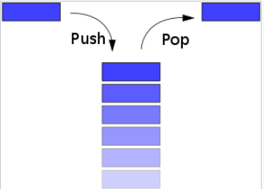
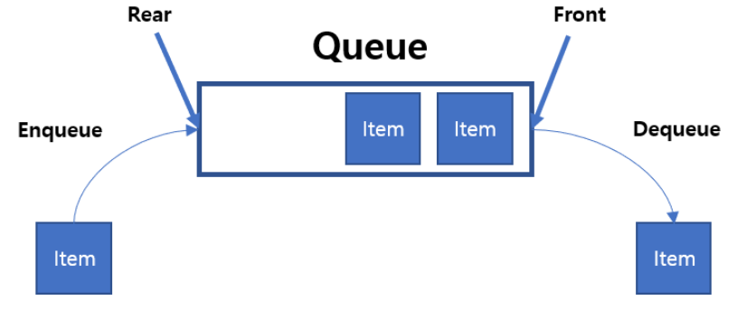
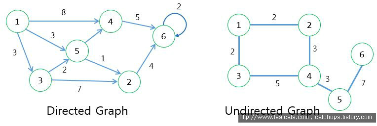
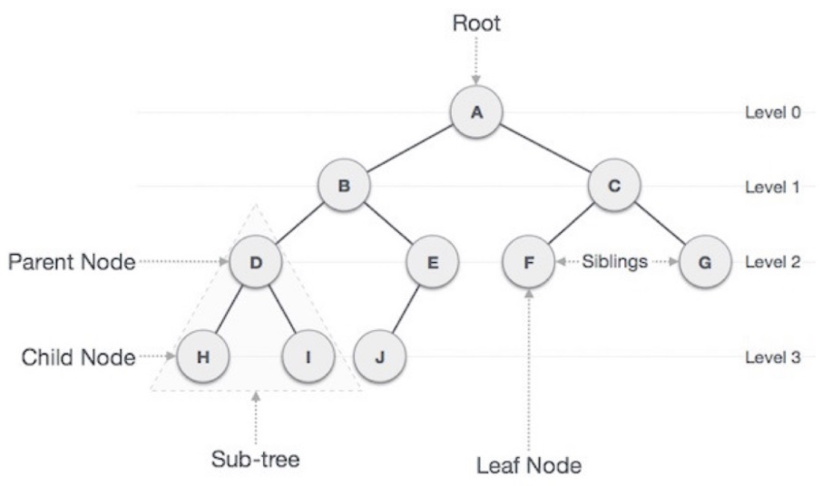

-----
 ## 진우 

 ### 💡 Array
  - 연관된 데이터를 하나의 변수에 그룹핑하여 관리하기 위한 구조
  - 1차, 2차, 3차 배열 모두 데이터 구조에 속합니다. 
  - 배열은 고정된 크기를 가지도록 선언/초기화 할 수 있으며 배열 범위를 초과할 경우 인덱스 초과 런타임 오류가 발생합니다.
  - #### 장점 : 배열은 순차탐색, 랜덤액세스가 빠릅니다.
  - #### 단점 : 고정된 크기를 동적으로 바꿀 수 없습니다. 데이터 삽입, 삭제가 비효율적입니다.
  <br/><br/>
  

 Ex. 변수 A 에 스터디원의 이름을 담아보자
 
  |***A***|진우|가빈|윤아|아연|민영|
  |--|-|-|-|-|-|  
  
   -> 변수 A에 진우, 가빈, 윤아, 아연, 민영 순으로 담겼습니다.
 
  #### 그렇다면 배열로 각 사람들이 좋아하는 CS 과목을 함께 묶어서 저장할 수는 없을까??  
 
  |***A***|진우|가빈|윤아|아연|민영|
  |--|:-:|:-:|:-:|:-:|:-:|
  |  |OS|DB|AI|Network|Data Structure|
  
  다음과 같은 데이터 구조를 저장하는 Java 기준 소스
  ```
    String[][] data = new String[2][5];
    for(int i=0; i<2; i++){
        for(int j=0; j<5; j++) data[i][j] = [담을 정보];
    }
  ```
  <br><br>
  
 
  ### 💡  Linked List
   - LinkedList는 다음과 같이 표현됩니다.    
       
   - LinkedList는 ArrayList와 함께 List를 구체화한 클래스입니다.  
   - ArrayList는 배열을 이용하여 List를 구현한 클래스입니다.  
   - 각 정보는 노드 내 데이터를 담는 파트에 저장되어있습니다.  
   - 노드는 데이터와 함께 다음노드(next), 이전노드(prev)와 연결되어 있습니다.  
   - #### 장점 : 삽입, 삭제가 빠릅니다. 어느 위치에 삽입, 삭제가 일어나도 해당 노드와 연결된 노드만 관리하면 됩니다.  
   - #### 단점 : 다음노드 참조를 위해 추가적인 메모리가 할당되어야합니다. 순차 탐색을 하므로 랜덤 액세스가 느릴 수 있습니다.

<br><br>

👉 [LinkedList 구현 Source](./LinkedList/Readme.md)


   - 자바에서 리스트 선언/초기화하는 방법
   ```
   LinkedList<Integer> integers1 = new LinkedList<>();                          // iNT 타입의 원소를 가지는 리스트
   LinkedList<Integer> integers2 = new LinkedList<>(Arrays.asList(1, 2, 3, 4)); // 배열 값을 리스트로 초기화
   
   integers1.add(10);  // 리스트의 마지막노드 뒤에 '10'값을 가지는 데이터 담기     integers1 = {10}
   integers1.add(0, 20);  // 리스트의 첫번째 위치에 '20'값을 가지는 데이터 담기    integers1 = {20, 10}
   integers1.set(0, 5);  // integers1 리스트의 첫번째 노드의 데이터를 '5'로 변경   integers1 = {5, 10}
   integers1.remove(5);  // '5' 값을 가지고 있는 첫번째 노드를 삭제합니다.         integers1 = {10}
   ```
   
  <br><br>
  
 ### 💡  Hash Table
  - Key, Value 쌍으로 데이터를 저장하는 구조로 가장 빠르게 데이터를 탐색할 수 있는 자료구조 중 하나입니다.   
  - 검색 속도가 빠른 이유는 내부적으로 배열을 사용하여 데이터를 저장하기 때문입니다.  
  - 각각의 Key 값에 해시함수를 적용하여 배열의 고유한 Index를 생성하고 이를 통해 검색을 진행합니다.  
  - 데이터 저장, 삭제, 조회에 드는 시간 복잡도는 O(1)입니다. (단, 해시 충돌 발생 시 O(N))   _(해시 충돌에 대한 자료 추후 추가 정리++)_
  - 해시 함수를 거친 값이 같아지는 현상인 해시 충돌의 경우는 '분리 연결법', '개방 주소법'를 통해 해결합니다.  _(추후 자료 추가 정리++)_   
  - #### 장점 : 저장, 삭제, 조회 속도가 빠릅니다.  
  - #### 단점 : 공간 복잡도(메모리 사용)가 큽니다. 순서가 없으므로 순차적 작업이 필요할 때는 효율성이 떨어집니다.  
 
  <br><br>
  * 해시테이블? 해시맵?  
   -> 우리는 자바에서 주로 HashMap을 통해 Key, Value 쌍 데이터를 저장하고 사용합니다.    
   -> HashTable과 HashMap의 차이는 동기화를 지원하는가? 여부에 있습니다.   
   -> HashTable : 동기화 지원 / HashMap : 동기화 미지원  
  <br>    
  put(삽입) 작업에서 HashTable과 HashMap의 차이  
  <br>

```
  public synchronized V put(K key, V value) {
        if (value == null) { throw new NullPointerException(); }
        
        Entry<?,?> tab[] = table;
        int hash = key.hashCode();
        int index = (hash & 0x7FFFFFFF) % tab.length;
        
        @SuppressWarnings("unchecked") Entry<K,V> entry = (Entry<K,V>)tab[index];
        for(; entry != null ; entry = entry.next) { 
            if ((entry.hash == hash) && entry.key.equals(key)) { 
                V old = entry.value; entry.value = value; return old; 
            } } addEntry(hash, key, value, index); return null; 
    } 
    
    
    public V put(K key, V value) {
        return putVal(hash(key), key, value, false, true);
    }
```
  
  HashTable은 Synchronized 키워드가 붙어있는 것과 같이 병렬 프로그래밍 시 동기화를 지원합니다.  
  병렬 처리를 고려한다면 HashTable을 그렇지 않다면 HashMap을 사용하면 됩니다.  
  
  <br><br>  
  
  ### 💡  Stack
       
   
   - 스택 자료구조는 다음과 같습니다.  
   - 자료에 대한 접근이 최상단 top으로 제한적이며 한쪽 방향으로 삽입하고 같은 방향으로 꺼내는 LIFO 구조입니다.   
   - Ex. A > B > C 순으로 스택에 데이터를 담았다면 C > B> A 순으로 스택으로부터 뽑아내게 됩니다.
   - #### 장점 : 구조가 단순하여 top에 대한 쓰기/읽기 속도가 빠릅니다.
   - #### 단점 : 데이터의 최대 개수를 미리 정해야하며 데이터 삽입 삭제가 빠르지만 스택의 top의 데이터만 쓰기/읽기가 가능하므로 작업이 매우 비효율적입니다.
  
   <br>
   
   - 스택을 사용하는 방법 in Java
   ```
   Stack<Integer> stack = new Stack<>();
   stack.push(1);    // 스택의 top에 1을 넣는다.
   stack.peek();     // 스택의 top 위치의 데이터를 읽는다.
   stack.pop();      // 스택의 top 위치 데이터를 뽑아낸다.
   stack.isEmpty();  // 스택이 비어있는지 체크한다. -> 비어있다면 true return
   ```
   
   <br><br>
   
  ### 💡  Queue
   - 먼저 넣은 데이터가 먼저 나오는 FIFO 구조의 자료구조입니다.  
     
   - 스택과 반대되는 개념입니다.  
   - 먼저 줄을 선 사람이 먼저 나갈 수 있는 상황과 같다고 생각하면 됩니다.  
   - 선형 큐, 환형 큐, Linked 큐 등이 있으며 우리가 주로 사용하는 것은 LinkedList 로 구현된 큐입니다.  
   
   - 큐을 사용하는 방법 in Java
   ```
   Queue<Integer> queue = new LinkedList<>();
   queue.offer(1);  // 큐에 '1'을 담는다
   queue.peek();    // 큐에서 가장 먼저 들어간 원소를 확인한다.
   queue.poll();    // 큐에서 LIFO로 원소를 1개 뽑는다.
   ```
   
<br><br>
    

  
  ### 💡  Graph   
  
      
   
   - 그래프는 노드와 해당 노드(Vertex)를 연결하는 간선(Edge)을 하나로 모아놓은 자료구조입니다.    
   - 즉, 연결되어 있는 객체 간 관계를 표현할 수 있는 효율적인 자료구조입니다.    
   - Ex. 지도, 지하철 노선, 전기회로 등등 -> BFS, DFS, Dijkstra, Kruskal 등 다양한 알고리즘 문제 예시로 활용   
   - 완전그래프 : 모든 노드에 대해 서로 최대로 간선이 연결된 상태를 의미합니다.   
   - 방향 그래프 : 간선에 방향성 O / 무방향 그래프 : 간선에 방향성 X    
   - 네트워크 모델로 사용됩니다.    
   - 출발 노드에서 도착 노드까지 2개 이상의 경로가 생길 수 있습니다.   
   - 노드간 관계는 평등합니다.   
   <br>
   
   #### 용어   
   <br>
   
   - 정점 : 위치, 노드   
   - 간선 : 위치간의 관계, 노드를 연결하는 선   
   - 인접 정점 : 간선에 의해 직접적으로 연결된 두 노드   
   - 차수 : 무방향(양방향) 그래프에서 하나의 정점에 인접한 노드의 개수   
   - 진입차수 : 방향 그래프에서 하나의 정점으로 들어오는 간선의 수   
   - 진출차수 : 방향 그래프에서 하나의 정점으로부터 나가는 간선의 수   
   
   <br>
   
   --> 그래프를 사용하기 위한 자료구조 준비 예시
   ```
   int[][] map = new int[][];
   List<int[]> map = new ArrayList<>();
   PriorityQueue<int[]> pq = new PriorityQueue<>((o1, o2) -> {return o1[] - o2[]});
   ```
   
   <br><br>

  ### 💡  Tree    
      
   <br>  
   
   - 방향성이 있는(단방향) 비순환 그래프의 한 종류입니다.   
   - 사이클(순환)이 절대 존재할 수 없습니다. 사이클(순환)이 존재하면 그것은 그래프!    
   - 순환이란 하나의 노드로부터 방문하지 않은 다른 노드들을 거쳐 자신으로 돌아오는 상황을 의미합니다.    
   - 부모-자식 관계로 이루어집니다.   
     
  
  <br>  
  ###💡  그래프와 트리의 차이  
  <br>  
  

   |  |그래프|트리|
   |:---:|:---:|:---:|
   |정의|노드와 그 노드를 연결하는 간선을 하나로 모아놓은 구조|방향성이 있는 비순환 그래프의 한 종류!|
   |방향성|단방향 + 양방향|단방향|
   |사이클|존재O|존재X|
   |루트|존재X|존재O|
   |모델|네트워크 모델|계층 모델|
   |탐색방식|DFS,BFS, Dijkstra...|DFS, BFS내 Pre, In, Post -order|
   |활용예시|지도, 지하철 노선, 회로, 도로|이진 트리, 이진 힙(최대, 최소)|

<br>


-----


:arrow_forward: [테스트](../Readme.md)
