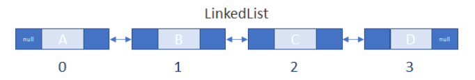

-----
 ## 진우 

 ### 💡 Array
  - 연관된 데이터를 하나의 변수에 그룹핑하여 관리하기 위한 구조
  - 1차, 2차, 3차 배열 모두 데이터 구조에 속합니다. 
  - 배열은 고정된 크기를 가지도록 선언/초기화 할 수 있으며 배열 범위를 초과할 경우 인덱스 초과 런타임 오류가 발생합니다.
####  - 장점 : 배열은 순차탐색, 랜덤액세스가 빠릅니다.
####  - 단점 : 고정된 크기를 동적으로 바꿀 수 없습니다. 데이터 삽입, 삭제가 비효율적입니다.
  <br/><br/>
  

 Ex. 변수 A 에 스터디원의 이름을 담아보자
 
  |***A***|진우|가빈|윤아|아연|민영|
  |--|-|-|-|-|-|  
  
   -> 변수 A에 진우, 가빈, 윤아, 아연, 민영 순으로 담겼습니다.
 
  #### 그렇다면 배열로 각 사람들이 좋아하는 CS 과목을 함께 묶어서 저장할 수는 없을까??  
 
  |***A***|진우|가빈|윤아|아연|민영|
  |--|:-:|:-:|:-:|:-:|:-:|
  |  |OS|DB|AI|Network|Data Structure|
  
  다음과 같은 데이터 구조를 저장하는 Java 기준 소스
  ```
    String[][] data = new String[2][5];
    for(int i=0; i<2; i++){
        for(int j=0; j<5; j++) data[i][j] = [담을 정보];
    }
  ```
  <br><br>
  
 
  ### 💡  Linked List
   - LinkedList는 다음과 같이 표현됩니다.  
   
   - LinkedList는 ArrayList와 함께 List를 구체화한 클래스입니다.
   - ArrayList는 배열을 이용하여 List를 구현한 클래스입니다.
   - 각 정보는 노드 내 데이터를 담는 파트에 저장되어있습니다.
   - 노드는 데이터와 함께 다음노드(next), 이전노드(prev)와 연결되어 있습니다.
####   - 장점 : 삽입, 삭제가 빠릅니다. 어느 위치에 삽입, 삭제가 일어나도 해당 노드와 연결된 노드만 관리하면 됩니다.
####   - 단점 : 다음노드 참조를 위해 추가적인 메모리가 할당되어야합니다. 순차 탐색을 하므로 랜덤 액세스가 느릴 수 있습니다.

<br><br>

   - 리스트 선언/초기화하는 방법
   ```
   LinkedList<Integer> integers1 = new LinkedList<>();  // iNT 타입의 원소를 가지는 리스트
   LinkedList<Integer> integers2 = new LinkedList<>(Arrays.asList(1, 2, 3, 4)); // 배열 값을 리스트로 초기화
   
   integers1.add(10);  // 리스트의 마지막노드 뒤에 '10'값을 가지는 데이터 담기   integers1 = {10}
   integers1.add(0, 20);  // 리스트의 첫번째 위치에 '20'값을 가지는 데이터 담기   integers1 = {20, 10}
   integers1.set(0, 5);  // integers1 리스트의 첫번째 노드의 데이터를 '5'로 변경   integers1 = {5, 10}
   integers1.remove(5);  // '5' 값을 가지고 있는 첫번째 노드를 삭제합니다.   integers1 = {10}
   ```
   
  
  💡  Hash Table
  💡  Stack
  💡  Queue
  💡  Graph
  💡  Tree
  💡  그래프와 트리의 차이


-----


:arrow_forward: [테스트](../Readme.md)
