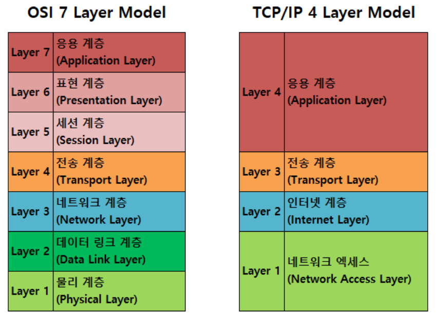
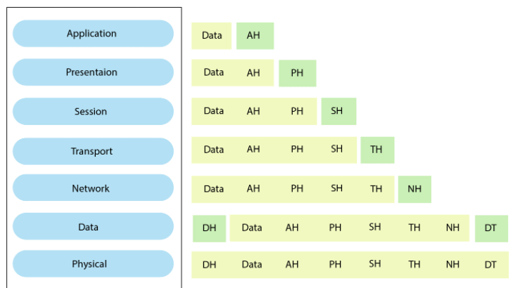
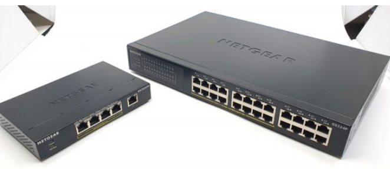

 ### OSI 7계층  

 OSI 7계층을 생각나는대로 적어보자!  
 - 물리 - 데이터링크 - 네트워크 - 전송 - 세션 - 표현 - 응용   
 - 끝..   공부해보자   
 
 #### 1. OSI 7계층?  &  OSI 7 Layer vs TCP 4 Layer  
   
 
 - OSI 모델은 국제 표준화 기구에서 개발한 네트워크 계층 모델입니다.   
 - 서로 통신을 위해 송신자의 데이터는 L7(응용)계층에서 L1(물리)계층으로 내려가서 수신자의 L1(물리)계층을 통해 전달되며 다시 수신자의 L7(응용)계층까지 올라가서 데이터 전송이 완료됩니다.  
 - L7 -> L1 과정을 Multipexing  /  L1 -> L7 과정을 Demultiplexing  
 - Multiplexing : Data에 Header를 추가하는 과정   
 - Demultiplexing : 순수 Data만 추출하는 과정   
 - 각 계층끼리는 통신을 위한 프로토콜이 존재합니다.  
    
 
    
 AH : Application Header  
 PH : Presentation Header  
 SH : Session Header  
 TH : Transport Header  
 NH : Network Header / NT : Network Tail  
 DH : Data Link Header / DT : Data Link Tail  
 
  
 #### 2. 각 계층  
 
 ##### 물리계층 (L1)   
     
 - 프로토콜 : RS-232  
 - 장비 : 허브, 리피터  
 - 역할 : 전달된 데이터를 전기적 신호(bit 단위)로 변환하여 통신  
 - 단위 : bit
 - 정의 : 실제 장치들을 연결하기 위해 필요한 전기적, 물리적 세부사항들을 정의하는 계층  

  
 ##### 데이터 링크 계층 (L2)  
     
 - 프로토콜 : HDLC, PPP, Frame Relay, ATM  
 - 장비 : 스위치, 브릿지  
 - 역할 : 오류 없는 데이터 전송을 위한 상위 계층에서 받은 패킷을 Frame으로 변환  
 - 단위 : Frame(프레임)  
 - 정의 : 노드 간 오류제어, 흐름제어, 회선제어 기능을 수행하는 계층  

 * Frame Relay : 

    
 ##### 네트워크 계층(L3)  
      
 - 프로토콜 : IP, ARP, RARP, ICMP, IGMP    
 - 장비 : 라우터, 스위치(L3)  
 - 역할 : 패킷을 분석하여 네트워크를 통해 출발지에서 목적지까지의 최적 경로를 선택   
 - 단위 : Packet(패킷)   
 - 정의 : 전송계층이 요구하는 QoS를 위한 수단을 제공하는 계층, 라우팅, 패킷 포워딩 등을 수행  
 
 * ARP : 
 * RARP : 
 * ICMP : 

 * 공유기 vs 라우터?
 - 
 
 
