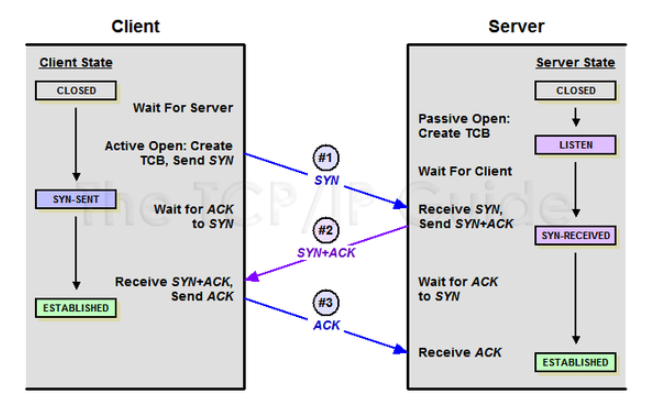
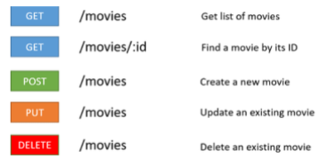

-----

 ### OSI 7계층  

 OSI 7계층을 생각나는대로 적어보자!  
 - 물리 - 데이터링크 - 네트워크 - 전송 - 세션 - 표현 - 응용   
 - 끝..   공부해보자   
 
 #### 1. OSI 7계층?  &  OSI 7 Layer vs TCP 4 Layer  
    
 
 - OSI 모델은 국제 표준화 기구에서 개발한 네트워크 계층 모델입니다.   
 - 서로 통신을 위해 송신자의 데이터는 L7(응용)계층에서 L1(물리)계층으로 내려가서 수신자의 L1(물리)계층을 통해 전달되며 다시 수신자의 L7(응용)계층까지 올라가서 데이터 전송이 완료됩니다.  
 - L7 -> L1 과정을 Multipexing  /  L1 -> L7 과정을 Demultiplexing  
 - Multiplexing : Data에 Header를 추가하는 과정   
 - Demultiplexing : 순수 Data만 추출하는 과정   
 - 각 계층끼리는 통신을 위한 프로토콜이 존재합니다.  
 
 <br>   
 
    
 
 AH : Application Header   
 PH : Presentation Header   
 SH : Session Header   
 TH : Transport Header   
 NH : Network Header / NT : Network Tail   
 DH : Data Link Header / DT : Data Link Tail   
 
 <br>  
 
 #### 2. 각 계층  
 
 ##### 물리계층 (L1)   
     
  
 - 프로토콜 : RS-232  
 - 장비 : 허브, 리피터  
 - 역할 : 전달된 데이터를 전기적 신호(bit 단위)로 변환하여 통신  
 - 단위 : bit
 - 정의 : 실제 장치들을 연결하기 위해 필요한 전기적, 물리적 세부사항들을 정의하는 계층  

 <br>  
 
 ##### 데이터 링크 계층 (L2)   
      
 
 - 프로토콜 : HDLC, PPP, Frame Relay, ATM  
 - 장비 : 스위치, 브릿지  
 - 역할 : 오류 없는 데이터 전송을 위한 상위 계층에서 받은 패킷을 Frame으로 변환   
 - 단위 : Frame(프레임)  
 - 정의 : 노드 간 오류제어, 흐름제어, 회선제어 기능을 수행하는 계층  

 * Frame Relay : 하나의 물리적 회선에 여러 개의 논리 회선인 가상회선(Pemanent Vitual Circuit)을 만들어 마치 전용선처럼 사용하는 서비스, L2 WAN 프로토콜  
    => 비싼 망 구성 물리적 비용을 줄일 수 있다.  
 
 <br>    
 
 ##### 네트워크 계층(L3)   
       
  
 - 프로토콜 : IP, ARP, RARP, ICMP, IGMP    
 - 장비 : 라우터, 스위치(L3)   
 - 역할 : 패킷을 분석하여 네트워크를 통해 출발지에서 목적지까지의 최적 경로를 선택    
 - 단위 : Packet(패킷) <- 데이터가 나누어진 여러 조각   
 - 정의 : 전송계층이 요구하는 QoS를 위한 수단을 제공하는 계층, 라우팅, 패킷 포워딩 등을 수행   
 
 * ARP : 주소 결정 프로토콜 : IP -> MAC   
 * RARP : MAC -> IP    
 * ICMP : 인터넷 제어 메시지 프로토콜 : 오류 메시지를 전송받는데 사용되는 프로토콜   
 
 #### 공유기 vs 라우터?  
  -> 공유기 : 단일회선, 단일 IP 에서 하위 클라이언트 장비들이 인터넷 연결을 가능하게 해주는 장비입니다. NAT 장비로서 공인 IP를 사설 IP로 분배하여 각 PC, IoT 장비에 분배하는 역할을 수행합니다.      
      -> 즉, 가정에서 할당받는 1개의 IP를 통해 다양한 기기가 공유기를 통해 사설 IP 를 할당받아 네트워크에 연결되도록 합니다.  
 
  -> 라우터 : 서버와 클라이언트간 효율적으로 연결을 분배하고 다양한 패킷을 분산하여 보내고 받을 수 있는 장비입니다. 공인 IP를 보내고 받는 역할을 하며 목적지까지의 최적의 경로를 설정하는 역할을 수행합니다.  


 <br>
 
 ##### 전송 계층(L4)  
     
  
  - 프로토콜 : TCP, UDP, RTP  
  - 장비 : 게이트웨이, L4 스위치  
  - 역할 : 양 끝단의 사용자들이 신뢰성 있는 __데이터를__ 주고 받을 수 있게 해주는 역할, Port를 통해 패킷을 생성 & 전송합니다.   
  - 단위 : 세그먼트(Segment)    
  - 정의 : End-to-End 통신을 다루며 신뢰성 있는 패킷을 생성 및 전송하고 오류검출, 복구, 흐름제어 등에 사용되는 프로토콜  
  (TCP, UDP는 뒤에서 다루겠습니다.)  
  
 <br>
 
 ##### 세션 계층(L5)  
      
  
  - 프로토콜 : SSH, TLS, NetBIOS  
  - 역할 : Port 번호를 기반으로 연결하며 통신 장치간 상호작용에 대해 설정하고 동기화합니다, TCP/IP 세션을 생성/파기하는 역할을 합니다.(OS에서 수행)  
  - 세션이란 __데이터가 통신하기 위한 논리적인 연결을 뜻합니다.__   
  - 단위 : 메시지  
  - 정의 : 통신 세션을 구성하는 계층으로 Port 기반으로 연결하여 상호간 연결을 유지하게 하는 프로토콜  

 <br>
 
  ##### 표현 계층(L6)   
  - 프로토콜 : MPEG, JPG, PAP, SMB  
  - 역할 : 사용자(응용) 계층으로부터 받은 데이터를 하위 계층으로 보내기 전 통신에 적당한 형태로 변환하는 역할을 합니다. (EBCDIC -> ASCII , 확장자 구분을 통해 JPG, GIF, TXT 등 표현하는 역할 등)     
  - 반대로 세션에서 받은 객체 메시지는 응용 계층에 맞게 변환하는 역할도 수행합니다.   
  - 단위 : 메시지, 데이터  
  - 정의 : 코드 간 번역을 담당하여 데이터의 형식 차이를 다루는 부담을 덜어주며 인코딩, 암호화 등을 통해 적절한 변환을 수행하는 프로토콜   

 <br>

 ##### 응용 계층(L7)   
  - 프로토콜 : DHCP, DNS, FTP, HTTP, TELNET, SMTP   
  - 역할 : 응용 SW를 도와주는 계층  
  - 단위 : 메시지, 데이터   
  - 정의 : 응용 프로세스와 직접적으로 연결을 통해 응용 서비스를 수행하도록 돕는 프로토콜입니다.  

 * FTP : 파일 전송 프로토콜   
 * SMTP : 메일 전송 프로토콜   

-----


<br><br>  

### TCP/IP   

<br>  

 #### TCP/IP 란?   
  : 통신을 하기 위한 규칙 중 하나로써 일반적으로 메일, 컴퓨터간 파일 전송, 원격 로그인 등의 통신을 지원합니다.   
  : 데이터가 목적지에 잘 도착할 수 있도록 보장하는 통신 규약   
  
  <br>
  
 - TCP : 두 호스트가 교환하는 데이터와 승인 메시지 형식을 정의하여 신뢰성있는 정보 전달을 목표로 합니다.  
   -> TCP는 패킷에 일련 번호를 부여하여 데이터 손실을 최소화하고 순서를 재조합하여 클라이언트에게 전달할 수 있게 해줍니다. & 데이터가 손실된 경우 재전송을 요청   
   -> 따라서 신뢰성이 높은 프로토콜   
 
 - IP : 컴퓨터 간 데이터 전송을 위해 서로의 주소가 필요합니다. Internet Protocol은 4byte로 이루어진 주소를 의미하며 192.168.0.1 과 같이 나타냅니다.  
   -> 단지 데이터가 전달 될 수 있도록 주소만 가지는 역할을 담당합니다.  
   -> MAC(물리적인 장비의 고유 주소) 주소와는 다르게 IP는 통신사(다른 주체)로 부터 할당 받는 것이므로 변동될 수 있습니다.  
 
 - TCP/IP : 통신을 위해 IP 기반으로 TCP가 사용되어서 TCP/IP 라고 불립니다.  
 - TCP : 데이터 신뢰, 추적 / IP : 주소 배달지 

-----

<br>  

### TCP vs UDP  

 <br>  
 
 #### TCP와 UDP  
 * 두 프로토콜 모두 데이터 전송을 목적으로 하는 전송계층 프로토콜입니다.  
 - TCP : 인터넷 상에서 데이터 전송을 위해 IP와 함께 사용되는 프로토콜   
 - UDP : 데이터를 데이터그램 단위로 처리하는 프로토콜   

 #### 특징   
 - TCP : 신뢰성있는 데이터 전송을 보장하며 패킷에 일련 번호를 부여하여 데이터 손실을 최소화하고 순서를 재조합하여 클라이언트에게 전달   
 - UDP : 비연결형 프로토콜로 연결을 위해 할당되는 논리적인 경로가 없습니다. 각 패킷들은 서로 다른 경로를 통해 전송되고 패킷은 독립적으로 이동하여 클라이언트에게 전달  
 
 <br>  
 
 __TCP__  
 1. 연결형 서비스로 가상 회선 방식 사용(출발 - 도착 연결을 위한 논리적 경로를 배정)    
 2. 3(연결) and 4(해제) way hand-shaking 과정을 통해 통신   
 3. 높은 신뢰성  
 4. 흐름제어, 혼잡제어, 오류제어  
 5. UDP 대비 상대적으로 느리다.  -> 패킷에 대한 응답을 필요로 하기 때문 (CPU 자원 소모, 시간 지연)  
 6. 서버 소켓은 연결만 담당합니다.  
 7. 스트림 전송 (데이터 크기 무제한)   
 8. 서버와 클라이언트는 1:1로 연결  

 __UDP__   
 1. 비연결형 서비스로 데이터그램 방식 사용  
 2. 정보를 보내고 받는다는 신호를 서로간에 주고받지 않습니다.  비 신뢰성 & 실시간 속도  
 3. 신뢰성이 낮다.  
 4. UDP 헤더의 CheckSum 필드를 통해 최소한의 오류만 검출합니다.  
 5. TCP 대비 상대적을 빠릅니다.  
 6. UDP는 논리적 연결 자체가 없어서 Connect 함수가 필요없고 서버 소켓과 클라이언트 소켓의 구분이 없습니다.  
 7. 소켓이 아닌 IP 기반 데이터 전송  
 8. 흐름제어 X  
 9. 서버와 클라이언트는 1:1 ~ N:N 으로 연결  
 
 <br>  
 
 따라서, TCP 는 신뢰성을 필요로하는 메일, 파일 전송 등과 같은 통신에 사용 / UDP는 신뢰성이 낮지만 실시간 전송 속도에 최적화되어 실시간 스트리밍과 같은 통신에 사용됩니다.  
 
 <br><br>  
 
 -----

### TCP & UDP 헤더를 들여다보자  

<br>  

 #### TCP Header   
     
  
  - Source Port Address : Well-Known port(0 to 1023), Registered port(1024 to 49151), Dynamic port(49152 to 65535)    
  
  - Destination Port Address : 목적지 어플리케이션이 사용하는 포트 번호   

  
  |Port|Service|
  |:-:|:-|
  |21|FTP(파일)|
  |23|TELNET(장비관리)|
  |25|SMTP(메일)|
  |80|HTTP(웹)|
  |110|POP3(메일)|
  |194|IRC|
  |443|HTTPS(Secure)|
  |8080|Alternative HTTP|
  
  
  - Sequence number : 전송 데이터의 모든 바이트에는 고유 일련 번호가 부여되어 세그먼트 순서가 어긋나거나 분실되어도 이를 재배열 조합할 수 있습니다.   
  - Acknowledgment number : 다음 세그먼트(전송 계층 단위)를 수신할 준비가 되었다는 신호입니다.  
  - Control flags : 8개의 서로 다른 제어 비트   
     ###### CWR : Congestion Window Reduced) – 혼잡 윈도우 크기 감소  
     ######  ECN : Explicit Congestion Notification) – 혼잡을 알림   
     ######  URG(Urgent) : Urgent Pointer 필드가 가리키는 세그먼트 번호까지 긴급 데이터를 포함되어 있다는 것을 뜻한다  
      ######  이 플래그가 설정되지 않았다면 Uregent Pointer 필드는 무시되어야 한다.  
     ######  ACK(Acknowledgment) : 확인 응답 메시지  
     ######  PSH(Push) : 데이터를 포함한다는 것을 뜻한다.  
     ######  RST(Reset) : 수신 거부를 하고자 할때 사용  
     ######  SYN(Synchronize) : 가상 회선이 처음 개설될 때 두 시스템의 TCP 소프트웨어는 의미 있는 확인 메시지를 전송하기 위해 일련 번호를서로 동기화해야 한다.  
     ######  FIN(Finish) : 작업이 끝나고 가상 회선을 종결하고자 할 때 사용  

  - checksum : TCP 세그먼트의 내용이 유효한 내용인지 검증 & 손상 여부를 검사할 수 있는 CheckSum 값  
  

 #### UDP Header  
     
  
  - Source Port : 송신자의 포트번호  Well-Known port(0 to 1023), Registered port(1024 to 49151), Dynamic port(49152 to 65535)    
  - Destination Port : 수신자의 포트번호  Well-Known port(0 to 1023), Registered port(1024 to 49151), Dynamic port(49152 to 65535)    
  - UDP Length : UDP 헤더와 데이터를 합친 길이 정보  
  - UDP CheckSum : UDP 헤더와 데이터를 모두 포함하여 체크하기 위한 최소한의 CheckSum   

 
 
 -----
  
 
 <br><br><br>
 
 ### TCP의 3-way-handshake와 4-way-handshake   
 
 <br>
 
 - 신뢰성 있는 연결을 통해 안전한 통신 방식   
 - 3 way handshake : 연결을 맺을때!   
 - 4 way handshake : 연결을 끊을때!   

 <br>

 - 3 way handshake : TCP/IP 프로토콜을 통해 응용프로그램이 데이터를 전송하기 전 __정확한 연결 및 전송을 보장하기 위헤 상대방과 사전에 세션을 수립하는 과정__ 을 의미합니다.   
 1. Client -> Server : TCP SYNC  : 서버에 접속을 요청하는 SYN 패킷을 전송하고 클라이언트는 SYN/ACK 응답을 기다립니다.  
 2. Server -> Client : TCP SYNC ACK  : 서버는 SYN 요청을 받고 클라이언트에게 알겠다는 ACK 와 SYN flag 가 설정된 패킷을 발송한 후 클라이언트의 ACK 응답을 기다립니다.   
 3. Client -> Server : TCP ACK  : 클라이언트는 서버로부터 ACK 와 SYN 신호르 받아 ACK 를 보내고 연결이 성사됩니다.   
    
 
 <br>
 
 - 4 way handshake : TCP/IP 프로토콜의 __연결된 세션을 종료하기 위해__ 수행되는 절차입니다.    
 1. Client -> Server : 클라이언트가 서버에 연결을 종료하겠다는 FIN flag를 전송한다.    
 2. Server -> Client : 서버는 ACK 메시지를 보내고 자신의 통신이 끝날때까지 기다리는 상태가 됩니다.   
 3. Server -> Client : 서버가 통신이 끝났으면 연결이 종료되었다고 클라이언트에게 FIN 플래그를 전송한다.   
 4. Client -> Server : 클라이언트는 서버에 ACK 신호를 보낸다.   
     
 
 
 - 만약, 서버에서 클라이언트로 FIN을 전송하기 전에 전송한 패킷이 Routing 지연이나 패킷 유실로 인한 재전송으로 인해 FIN 패킷보다 늦게 도착하는 상황이 발생한다면??   
  : Client에서 세션을 종료시킨 후 뒤늦게 도착하는 패킷이 있을 수 있으니 일정시간동안 세션을 유지하고 잉여패킷을 기다리는 과정을 거칩니다. 이를 Time_Wait 라고 합니다.   
  
 <br><br> 
 -----
 
 
 ### HTTP vs HTTPS(Http + SSL)    
  #### HTTP? 서버/클라이언트 모델을 따라 데이터를 주고 받기 위한 프로토콜 입니다.   
  
  - HTTP 는 기본 포트로 80 포트를 사용하며 대체 포트인 8080, 8081이 있습니다.   
  - HTTPS 는 기본 포트로 443 포트를 사용하며, 네트워크 상에서 중간에 제 3자가 정보를 볼 수 없도록 공개키 암호화를 지원합니다.   
  - SSL : Secure Socket Layer   
  
  <br>
  
  - HTTP는 어플리케이션 레벨의 프로토콜로 TCP/IP 위에서 작동합니다. HTTP는 상태를 가지고 있지 않는 Stateless(상태정보X) 프로토콜이며 Method, Path, Version, Header, Body로 구성됩니다. 
  - 하지만, HTTP는 평문데이터를 전송하는 프로토콜이기에 HTTP로 기밀 정보를 주고 받기에는 보안상 문제가 발생합니다.   
  - HTTPS는 HTTP에서 데이터 암호화가 추가된 프로토콜이며 __공개키 암호화__ 를 사용합니다.(실제 데이터 암호화느 대칭키, 키 교환에는 공개키 암호화를 사용 <- 속도개선)    
  - 공개키(비대칭키) (RSA) 암호화 : 비밀키 & 공개키  
   &nbsp; -> 공개키 : 모두에게 공개가능한 키   
   &nbsp; -> 개인키 : 나만 가지고 비밀로 해야하는 키    
  - 공개키 암호화 : __공개키__ 로 암호화하면 __개인키__ 로만 복호화할 수 있습니다. (누군가 개인키를 가진사람에게 비밀로 정보를 전송하는 용도)   
  - 개인키 암호화 : __개인키__ 로 암호화하면 __공개키__ 로만 복호화할 수 있습니다. (자기가 자기 자신임을 인증하는 용도)    
  
   암호문을 B만 볼 수 있도록 기밀성을 유지하여 전송    
       
   
   누구나 볼 수 있지만 A가 서명한 것임을 인증   
       
  
  <br>
  
  #### HTTPS 동작 과정!  
  - HTTPS 는 데이터를 암호화하여 전송하기에 제 3자가 데이터를 탈취하더라도 기밀을 유지할 수 있습니다. 서버와 클라이언트 사이에는 클라이언트가 데이터를 확인하기 위해 복호화 할 수 있는 공개키가 필요하게 됩니다. 일반적으로는 인증된 기관으로부터 공개키를 전송하여 인증서를 발급하는 방식으로 HTTPS 통신이 이루어집니다.   
  &nbsp; 1. A는 HTTP 기반 애플리케이션에 HTTPS를 적용하기 위해 공개키/개인키를 발급합니다.   
  &nbsp; 2. 인증된 기관에 A의 공개키를 저장하는 인증서 발급을 요청합니다. (공개키가 포함된 인증서)   
  &nbsp; 3. 인증 기관은 이름, 서버의 공개키, 서버 정보를 기반으로 인증서를 생성하고 인증기관의 개인키로 암호화하여 A에게 이를 제공합니다. (인증서 발급자가 인증기관임을 증명)    
  &nbsp; 4. A기업은 클라이언트에게 암호화된 인증서를 제공합니다. (인증서 제공)     
  &nbsp; 5. 브라우저는 인증 기관의 공개키를 이미 갖고있어 암호화된 인증서를 복호화할 수 있습니다. (CA의 공개키를 통해 인증서 복호화 가능 -> CA의 인증서임을 검증 가능)   
  &nbsp; 6. 암호화된 인증서를 복호화하여 A기업의 공개키를 알 수 있고 이를 통해 데이터를 암호화하여 요청을 전송합니다. (A의 공개키로 암호화하여 데이터 요청 -> A만 개인키로 복호화 가능)  
  * 그림으로 정리해두기!   
 
 &nbsp; 따라서, 단순한 정보 조회를 위한 통신이라면 HTTP, 민감한 정보가 포함되었다면 암호화 기술이 포함된 프로토콜인 HTTPS를 사용하면 됩니다.    
  
  <br><br> 
  
 ### HTTP 요청과 응답 Header   
  #### 요청    
  - HTTP 요청의 헤더 정보는 크게 3부분으로 분류할 수 있습니다.   
  - 일반헤더, 요청/응답 헤더, 엔티티 헤더  
  
  
 1. 일반헤더 : HTTP Body와는 관련 없고 생성된 날짜 및 시간, 연결과 같은 통신에 대한 일반 정보가 포함됩니다. 요청/응답에 공통으로 사용됩니다.    
 &nbsp; -  Date, Connection, Content-Length, Cache-Control, Content-Type    


 2. 요청(Request)/응답(Response) 헤더 : 요청과 응답에 대한 정보가 들어있는 헤더이며 URL, Method, 브라우저 정보 등이 포함됩니다.     
 &nbsp;  - Request. Host, User-Agent, Accept, Cookie, Origin, Authorization    
 &nbsp;  - Response. Server, Access-Control-Allow-Origin, Allow, Location, Content-Security-Policy, Access-Control-Expose-Header   
  
  
 3. 엔티티 헤더 : 메시지, Body 본문에 대한 정보가 포함됩니다. 컨텐츠의 길이, 언어, 인코딩, 만료날짜 등의 정보가 포함되어 있습니다.    
 &nbsp;  - Content-Length, Content-Language, Content-Encoding   

 <br>  
 
 * Request Method  
   GET(URI 요청, Query String)    
   POST(Body에 데이터 전송)    
   HEAD(Header 정보만 요청)   
   PUT(Body에 데이터 전송)   
   PATCH(단 1개의 정보만 수정, Body에 데이터 전송)    
   DELETE(URI 요청, 삭제)   
   OPTIONS        
  
 <br>
 -----
 <br>

 ### CORS   
  #### Cross Origin Resource Sharing : 교차 출처 리소스 공유   
  - 다른 출처의 자원에 접근할 수 있는 권한을 부여하도록 브라우저에게 알려주는 체제이며 보안상의 이유로 기본적으로 브라우저는 교차 출처의 요청을 제한합니다.   

  

  - CORS 허용의 경우  
  &nbsp; 1. XMLHttpRequest  
  &nbsp; 2. WebGl 텍스쳐   
  &nbsp; 3. drawImage()를 사용한 이미지/비디오 프레임  
  &nbsp; 4. 이미지로부터 호출되는 CSS   

  <br>
  
  #### REST API 에서 리소스에 대한 CORS 활성화 필요 여부   
  - REST API 요청 시 비단순 cross-origin 요청을 받을 때 CORS 지원을 활성화해야 합니다. (단순 요청은 상관 없음)    
  
  __단순 요청?__    
  - 다음 모든 조건을 충족하면 단순 요청! 이외는 모두 비단순 요청!   
  &nbsp; 1. GET, HEAD, POST 방식으로 발행된 요청   
  &nbsp; 2. POST 요청의 경우 Origin 헤더를 포함   
  &nbsp; 3. Payload Contents-Type 이 text/plain,   multipart/form-data 또는 application/x-www-form-urlencoded 입니다.   
  &nbsp; 4. 요청 내에 사용자 임의 지정(추가) 헤더가 없습니다.    
  &nbsp; 5. 단순 POST 요청에서 리소스의 응답에 Access-Control-Allow-Origin 헤더가 포함되어야 합니다. 헤더 키 값은 '*' 혹은 허용 오리진으로 설정    
  
  &nbsp; -> 위 조건을 만족하지 않는 모든 요청은 비단순 요청으로 CORS 지원을 활성화해야 통신이 가능합니다.   
  
  <br>
  
  
__CORS 지원 활성화__    
- 브라우저에서 비단순 HTTP 요청을 받을 경우 CORS 프로토콜은 __preflight 요청__ 을 먼저 서버로 보내고 서버의 승인을 기다린 후 허가가 나면 실제 요청을 보내 처리하도록 합니다.    
- preflight 요청   
&nbsp; - Origin 헤더를 포함합니다.  
&nbsp; - OPTIONS Method를 이용합니다.   
&nbsp; - Access-Control-Request-Method, Access-Conrol-Request-Headers 헤더를 포함합니다.   

<br>
 
CORS 지원을 활성화 하는 방식은 API 통합 유형에 따라 상이합니다.   

#### Spring Boot 에서의 CORS 허용   
- springframework.web.cors 라이브러리 & Spring Security import
- @Bean 주입    
```

    @Override
    protected void configure(HttpSecurity http) throws Exception {
        http
            .authorizeRequests()
                .requestMatchers(CorsUtils::isPreFlightRequest).permitAll()
                .anyRequest().permitAll()
            .and()
                .cors().configurationSource(corsConfigurationSource())
                .and()
                .csrf().disable()
    }
    
    
    @Bean
    public CorsConfigurationSource corsConfigurationSource() {
        CorsConfiguration configuration = new CorsConfiguration();

        configuration.addAllowedOriginPattern("*");   // Origin 패턴(사이트 도메인 ex) localhost:8080, http://172.168.45.72, ..) 모두 허용   
        configuration.addAllowedHeader("*");          // 특정 Header(Content-Type, Authorization, x-xsrf-token, .. )에 대해 허용 
        configuration.addAllowedMethod("*");          // 특정 Method(GET, POST, PUT, ..)에 대해 허용
        configuration.setAllowCredentials(true);      // 자격증명과 함께 요청 여부, Authorization으로 사용자 인증 사용 시 true
        configuration.addExposedHeader(accessToken);   // REST API 에서 클라이언트에게 지정 Header 정보를 추가 전달할 때 설정 사용
        configuration.addExposedHeader(refreshToken);
        configuration.setMaxAge(3600L);               // 클라이언트의 preflight 요청으로부터 받은 서버로의 응답 Cache 유지 시간(Sec) -> 클라이언트의 캐시

        UrlBasedCorsConfigurationSource source = new UrlBasedCorsConfigurationSource();
        source.registerCorsConfiguration("/**", configuration);
        return source;
    }

```

  - CORS를 통해 외부로부터의 요청에 대한 보안을 강화할 수 있습니다.    
  
  <br>
  
  -----
    
  <br>
 
  ### GET Method vs POST Method   
   #### GET 방식과 POST 방식 통신   
   
   - HTTP 프로토콜이 제공하는 GET, POST, PUT, PATCH, DELETE, OPTIONS, HEAD, TRACE 8가지 메소드 중 GET, POST에 대해 깊게 알아보자!  
       
   
   <br> 
  
   
   #### GET  
   - 데이터를 URL 뒤 Query String으로 붙여서 전송합니다.   
   - 데이터는 key=value 쌍으로 담아서 전송합니다.   
   - url/url/url?key=value 와 같이 url과 query string 데이터 부분을 '?' 구분자로 구분합니다.   
   - 여러개의 데이터를 담을 땐 url/url/url?key1=value1&key2=value2 와 같이 '&' 구분자로 데이터를 분리합니다.   
   - GET 방식은 BODY에 데이터를 담지 않으므로 Body의 Content-Type에 대한 정보를 알려주는 Content-Type 헤더 필드는 포함되지 않습니다.   
   - url에 데이터가 포함되어 전송되므로 데이터가 노출되기 쉽습니다.   
   - 최대 2KB 데이터를 포함할 수 있습니다. (전송 데이터 양에 제한)   

   - Query String VS Path Variable   
   &nbsp; - Query String : url 뒤에 ? 구분자 이후 Key=Value 쌍으로 전송하는 데이터를 Query String 이라고 합니다.    
   &nbsp; - Path Variable : url/{data}/url/{data} 와 같이 url 어디든지 데이터가 바인딩되어 들어갈 수 있는 형태를 Path Variable 이라고 합니다. REST API 표현 형태로 적절합니다.    
   &nbsp; - 사용예   
   &nbsp;&nbsp; - Query String => /users?occupation=programer : 직업군이 프로그래머인 사람 목록을 가져온다.    
   &nbsp;&nbsp; - Path Variable => /users/123 : 유저 ID가 123인 사람의 정보를 가져온다.   
   
   <br>
    
   #### POST   
   - 데이터를 Body에 담아서 전송합니다.  
   - 데이터는 다양한 형태가 될 수 있으며 이는 요청헤더의 Content-Type 필드에서 명시합니다.    
   - Content-Type : text/plain, multipart/form-data, application/x-www-form-urlencoded(Default), application/json  등등    
   - 데이터가 url에 담기지 않고 Body에 담기지 않으므로 데이터 노출 가능성이 상대적으로 적습니다. 하지만 기밀 데이터에 대해서는 반드시 암호화가 필요합니다.  
   - GET 방식보다 상대적으로 느립니다. 이유는 GET 방식의 요청은 캐싱(최초 접근 후 요청 데이터를 저장시켜둔다.)을 사용하기 때문입니다.
   
   <br>
   
       
   
  <br>
  
  -----
    
  <br>
   
  ### 쿠키과 세션  
  <br>
  
  <src img="./images/cookiesession.png" width="50%">  
  
   #### Cookie : 웹 쿠키, 브라우저 쿠키 등으로 불리며 서버 -> 클라이언트에게 전송하는 작은 데이터 조각을 의미합니다.   
   
   - 쿠키가 존재하는 이유 : Http 프로토콜은 Stateless한 특징을 가지며 상태 정보가 없기에 서버와 클라이언트 간 상태정보를 대신할 정보를 저장하기 위해 쿠키가 탄생했습니다.   
   - 쿠키는 소규모 서버의 세션관리, 개인 설정 유지(장바구니), 사용자 행동 트래킹(분석) 등의 용도로 사용됩니다.    
   - 쿠키 하나에 4KB 용량의 데이터를 저장할 수 있고 텍스트 데이터를 저장할 수 있습니다. BLOB 과 같은 Binary type의 데이터를 저장할 수는 없습니다.   
   - 쿠키는 클라이언트에 저장됩니다.   
   - 쿠키는 만료 날짜를 지정할 수 있으며 Default는 브라우저 종료 시 삭제됩니다. 만료 날짜를 지정할 경우 해당 날짜까지 쿠키가 Client Local에 남아있게 됩니다.   
   - 쿠키에는 경로정보가 포함되는데 웹 브라우저에 해당 서버의 쿠키가 남아있다면 Http 요청 시 헤더의 Cookie에 무조건 담아서 보냅니다.   
  
  
   #### Session : 통신을 위해 연결된 상태를 의미하며 연결 순간부터 끝맺음 순간까지의 기간을 뜻합니다.    
    
   - 세션은 보통 서버에 연결정보(세션, 클라이언트 상태정보)를 저장해두고 세션쿠키(세션ID)를 클라이언트에게 보내어 서버가 클라이언트를 식별할 수 있도록하는 방식을 의미하는 경우가 많습니다.  
   - 세션은 서버의 능력에 따라 저장 용량이 상이합니다.   
   - 서버에서 세션 객체를 생성하여 클라이언트 고유의 유일한 세션 ID 값을 부여하여 식별합니다.    
   - 클라이언트와 서버의 상태정보 세션은 서버에 저장되며 클라이언트에게는 세션 ID 값(이하 '세션쿠키')을 전송합니다.    
   - 웹 브라우저 종료 시 세션쿠키는 삭제됩니다.    
   - 클라이언트는 서버로부터 세션 ID를 받아 쿠키에 저장합니다. -> 쿠키는 경로정보가 포함되어 해당 서버로 요청 시 헤더에 Cookie(세션 ID)를 담아서 보내게 됩니다.(Client 식별)     
   - 세션은 쿠키를 이용한 클라이언트 식별 방식이라고 생각할 수 있습니다.   

  <br>
  
  -----
    
  <br>
 
 
  ### DNS : Domain Name System   
   #### DNS 정의 : 호스트의 도메인 이름을 호스트 네트워크 주소로 바꾸거나 반대로의 변환을 수행할 수 있도록 만든 시스템   

   - 우리는 특정 서버로 접속하기 위해서 IP 주소를 알아야합니다. 하지만 Google, Facebook 등 웹사이트에 접속할 때 IP를 사용하지 않고 www.google.com 과 같은 도메인 이름을 입력해서 웹 서버에 접속하게 됩니다.   
   - 192.0.2.1 과 같은 숫자로 된 IP 주소를 www.example.com 과 같이 사람이 읽기 쉬운 형태로 변환하여 접속을 가능케합니다.  
   - DNS 시스템은 이름과 IP 주소를 맵핑하여 관리하며 클라이언트가 이름에 대해 요청을 보내면 IP 주소로 변환하여 클라이언트를 어떤 서버로 보낼 것인지를 제어하게 됩니다.   
    &nbsp; -> 해당 요청을 Query 라고 부릅니다.   

   <br>

   Amazon Route 53 DNS 시스템 구성도 예시    
      

    1. 클라이언트가 도메인 주소를 입력하여 접속합니다.   
    2. ISP(인터넷 서비스 제공업체)가 관리하는 DNS Resolver로 라우팅됩니다.    
    3. ISP의 DNS Resolver는 www.example.com 에 대한 요청을 DNS root name server에 전달합니다.    
    4. DNS root name server에 도메인 정보가 없다면 .com TLD Name server 중 하나에 요청하라고 응답을 줍니다.   
    5. .com TLD Name server는 example.com 도메인과 연관된 도메인 정보가 없다면 Amazon Route 53 Name server의 이름을 사용하여 요청에 응답합니다.   
    6. DNS Resolver는 응답을 받아 Amazon Route 53 name server 중 하나를 선택하여 www.example.com에 대한 요청을 전달합니다.   
    7. Amazon Route 53 name server는 www.example.com 레코드(행)을 찾아 IP 주소(192.0.2.44) 등 연관된 값을 받아 DNS Resolver로 반환합니다.    
    8. ISP의 DNS Resolver는 해당 도메인 이름으로 접속할 수 있는 IP 주소 하나를 알아내고 이를 클라이언트에 전달합니다. 또한, IP 주소 캐싱을 통해 일정 기간 동안 도메인 이름 탐색에 빠르게 응답할 수 있도록 대응합니다.   
    9. 웹 페이지를 출력합니다.   
   
  <br>
   
   위와 같이 DNS 쿼리에 대한 IP 주소를 알아내기 위해 재귀적으로 DNS Server에 요청하는 것을 Recursive Query 라고 합니다.   
   
  <br>
  
  -----
    
  <br>
 
 ### REST API와 RESTful 개념   
  #### REST : Representaion State Transfer 의 약자입니다.   
    
 
  - REST 는 3가지 요소로 구성됩니다.  리소스, 메소드, 메시지   
  - HTTP 프로토콜을 그대로 활용하므로 웹의 장점을 최대한 활용할 수 있는 아키텍처 방식입니다.     
  - 'Jinwoo가 회원가입을 한다'. 의 호출에서  
  - 리소스(자원) : 사용자(jinwoo)  
  - 메소드(행위) : 가입(생성)한다.  
  - 메시지(표현) : 이름이 jinwoo인 사용자   
 
  &nbsp; - 리소스 : http://example/users 와 같이 URI로 표현이 됩니다.   
  &nbsp; - 메소드 : POST, GET, PUT, DELETE, PATCH 등과 같은 Http Method 로 표현합니다.   
  &nbsp; - 메시지 : 디테일한 내용은 Body(JSON, XML) 혹은 Parameter를 통해 표현합니다.   
 
 리소스 기반의 명사 형태로 URI를 정의하고 안전한 메소드 활용를 통해 요청을 표현하는 것이 REST 형태의 디자인입니다.     
 Ex)   
 조회 : GET, example/users/{id} or example/users?id=~~   
 수정 : PUT, example/users, body{id=~~, name = "jinu"}    
 삭제 : DELETE, example/users/{id}    
 
 <br>
 
 ###### 멱등성 : 같은 연산을 여러번 적용하더라도 결과에는 변함이 없는 것   
      -> Ex. POST 여러번 => 여러개 생성 / PUT 여러번 => 한번 바뀐 후 같은 요청 시 상태변화 X   
 
 |메소드|의미|멱등성|
 |:-:|:-:|:-:|
 |POST|Create|X|
 |GET|Read|O|
 |PUT|Update|O|
 |DELETE|Delete|O|

 <br>
 
 - REST API는 위 설계 방식을 기반으로 서비스 API를 구현한 것을 의미하며 RESTful은 REST 아키텍처를 구현하는 웹 서비스를 의미합니다.   
  -> REST 방식의 아키텍처를 따르는 서비스는 RESTful 하다 라고 말하며 이해하기 쉽고 사용하기 쉬운 REST API를 만드는 것이 RESTful의 지향점입니다.   
 
 RESTful 은 컨벤션 통일을 통한 개발자의 API 이해도와 호환성을 높이는 것이 주 목적이므로 성능이 중요한 상황에서 반드시 100% 따라야하는 방식은 아닙니다.   
 
 <br>
 
 -----
 <br>
 
 
 ### Socket  
  #### Socket : 네트워크 상에서 동작하는 프로그램 간 통신의 Endpoint(연결부)    
 
  - IP 주소와 port 번호로 최종 목적지를 나타낼 수 있습니다. 또한, 통신 프로토콜을 지정하여 통신하게 됩니다.  
  - 소켓 통신은 두 프로그램 간 통신이기에 양쪽에서 모두 통신을 위한 소켓이 생성되어야 통신할 수 있습니다.    
  - 일반적으로 서버 - 클라이언트 소켓 통신을 할 때 서버는 Listen(대기) 상태로 있으며 클라이언트가 통신 요청을 하면 이에 응답합니다.  
  - TCP, UDP 프로토콜을 사용합니다.(전송계층)   
 
 
 
 <br>
 
 Socket.io 의 서버 측 소켓 준비 예시

```
var app = require('http').createServer(handler)
var io = require('socket.io')(app);
var fs = require('fs');

app.listen(80);

function handler (req, res) {
  fs.readFile(__dirname + '/index.html',
  function (err, data) {
    if (err) {
      res.writeHead(500);
      return res.end('Error loading index.html');
    }

    res.writeHead(200);
    res.end(data);
  });
}

io.on('connection', function (socket) {
  socket.emit('news', { hello: 'world' });
  socket.on('my other event', function (data) {
    console.log(data);
  });
});
 
```
 
 - 예시는 80번 포트에 바인드하여 해당 Endpoint를 통해 클라이언트의 요청에 대기하게 됩니다.   
 - socket.emit()으로 클라이언트에게 데이터를 전달하며 socket.on()으로 클라이언트로부터 수신한 데이터를 받을 수 있습니다.   
 - 서버는 클라이언트와 소켓을 통해 연결되게 되면 다른 클라이언트로부터의 통신 요청 또한 받기 위해 새로운 포트로 소켓을 생성하게 됩니다.   
 
 <br>
 
 * Java Socket I/O (Server Thread)
```
 public class SocketThreadServer extends Thread {
	
	private static final Logger logger = Logger.getLogger(SocketThreadServer.class);
	
	private Socket socket;

	public SocketThreadServer(Socket socket){
		this.socket=socket;
	}
	
	//단순 문자열 Thread server
	public void run(){
		BufferedReader br = null;
		PrintWriter pw = null;
		try{
			String connIp = socket.getInetAddress().getHostAddress();
			System.out.println(connIp + "에서 연결 시도.");
			
			/*
			 * 접근한 소켓 계정의 ip를 체크한다. KTOA 연동 모듈인지 체크 
			 * 정상이면 먼저 정상 접근되었음을 알린다.
			 **/
			br = new BufferedReader(
			        new InputStreamReader(socket.getInputStream()));
			
			pw = new PrintWriter(socket.getOutputStream());
			
			// 클라이언트에서 보낸 문자열 출력
			System.out.println(br.readLine());
			
			// 클라이언트에 문자열 전송
			pw.println("수신되었다. 오버");
			pw.flush();		
		}catch(IOException e){
			logger.error(e);
		}finally{
			try{
				if(pw != null) { pw.close();}
				if(br != null) { br.close();}
				if(socket != null){socket.close();}
			}catch(IOException e){
				logger.error(e);
			}
		}
	}
}
 
```  
 <br><br>
 
### Socket.io VS webSocket   
 
 
 <br><br>
 
 
### Frame, Packet, Segment, Datagram   
 
 
 
 <br>
 
-----
 
 
 
