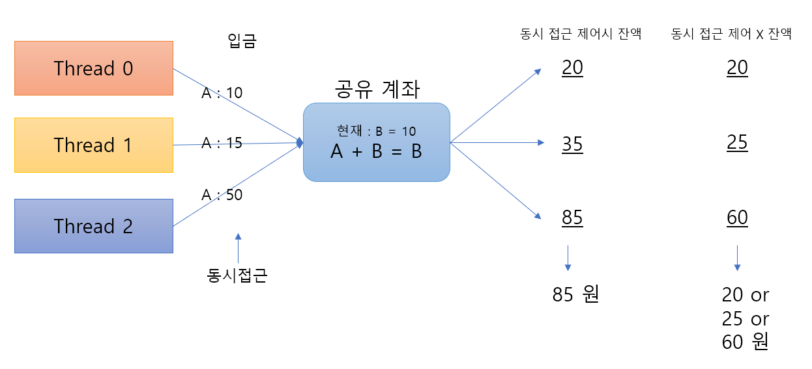
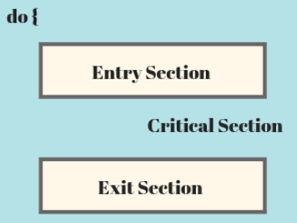
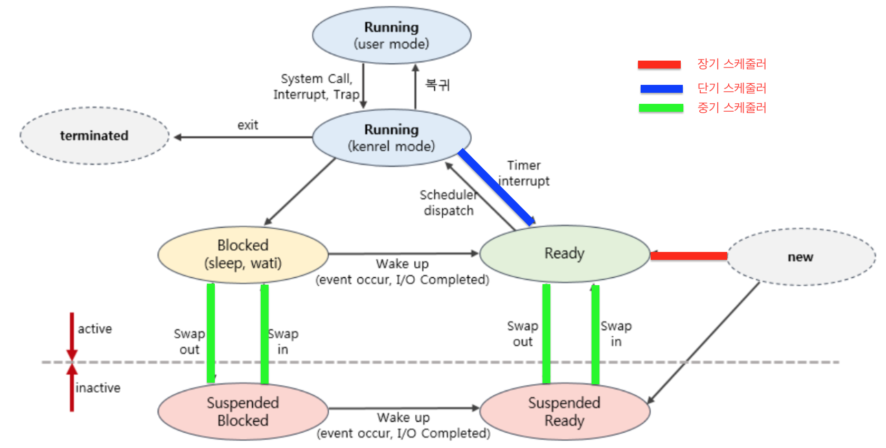
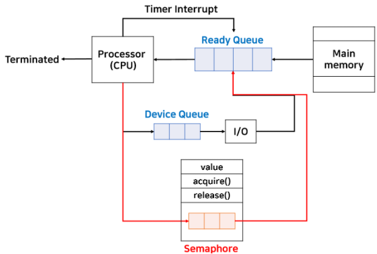

## Operating System  

 ### Thread와 Process   
  #### 스레드와 프로세스의 차이   
  - 스레드 : 프로세스가 할당받은 자원을 이용하는 실행 최소 단위   
  - 프로세스 : OS로부터 자원을 할당받은 작업 단위    
  - 프로세스는 프로그램이 메모리에 올라가 실행중인 상태를 뜻하며 Process ID를 가집니다.   
  - 프로세스는 단일스레드로 최초에 시작하고 하나의 프로세스에서 많은 동시 작업이 이루어져야하는 경우가 빈번히 발생합니다.  
  - 이에 따라 멀티 스레딩을 통해 하나의 프로세스에서 여러 작업이 진행될 수 있게 지원합니다.  

<br>

 #### 차이점
 
 ||스레드|프로세스|
 |-|-|-|
 |Code 공유|O|X|
 |Data 공유|O|X|
 |Stack 공유|X|X|
 |Heap 공유|O|X|  
 
   
 
 * code : 프로그램 코드 자체   
 * data : 정적 변수가 저장되는 영역   
 * stack : 로컬 변수나 매개(파라미터) 변수가 저장되는 영역  
 * heap : 동적으로 할당되는 변수가 저장되는 영역  
 
 <br>
 
 > 프로세스는 서로 다른 프로세스의 자원에 대해 접근할 수 없습니다.   
 > 프로세스 간 통신 (IPC) 를 통해 프로세스 간 데이터를 주고 받을 수 있습니다.    
 > IPC 방식 : Message Queue, Pipe, Socket, Shared Memory 등이 있습니다.  
 > 프로세스는 기본적으로 서로의 프로세스에 영향을 미치지 않습니다.  
 > 스레드는 하나의 스레드에서 오류가 발생하면 같은 프로세스 내 동작하는 스레드 모두가 강제 종료될 수 있습니다.   
 
 <br>
 
 #### 멀티 스레드의 장점 & 단점   
 
 <br>
 
 __장점__  
 - Context-Switching 시 공유 메모리만큼의 자원을 아낄 수 있습니다.    
 > 멀티 프로세스의 경우 시분할 작업에서 프로세스가 변경되었을 때 캐싱되어 있는 현재 프로세스의 데이터에 대해 모두 Context-Switching 되어야하므로 오버헤드가 큽니다.   
 - 스레드는 프로세스 내 Stack 영역을 제외한 모든 메모리를 공유하므로 통신에 대한 부담이 적습니다.   
 
 ** Context-Switching : 현재 진행중인 Task 작업을 저장하고 다음 진행할 Task 데이터를 읽어오는 과정   
 ** Process Control Block으로 관리되는 현재 Task 정보는 Register에서 Process Ready Queue로 옮겨지고 다음 진행될 Task에 대한 정보가 Register로 올라옴으로써 Context-Switching이 완료됩니다.   
 ** 시분할 작업을 하는 이유 : 사용자에 대한 응답성을 높이기 위해, 여러 작업을 돌아가면서 거의 동시에 처리하기 위해    
 
 <br>
 
 __단점__   
 - 스레드 간 공유되고 있는 변수에 대해 주의해야하며 스레드 에러 발생 시 같은 프로세스 내 모든 스레드가 종료됩니다.  
 - OS는 프로세스 단위까지만 관리하기 때문에 프로세스 내 멀티스레드에 대해서는 개발자, 관리자가 직접 제어해주어야 합니다.   
 - 데이터를 공유하기 때문에 반드시 동기화 문제가 발생하게 되어 이를 제어해주어야 합니다.   
   &nbsp; -> 웹 서버 환경에서 멀티스레드로 동작할 때 Singleton 객체를 생성함에 있어서 동기화 문제가 발생하지 않도록 Java(Synchronized)와 같은 키워드를 통해 제어해주어야 합니다.   
 
 <br><br>
 
 ### Thread-Safe   
  #### 스레드 세이프란?  
  - 다양한 작업이 시분할되어 진행되는 멀티 스레드 환경에서 어떤 함수나, 변수, 객체가 여러 스레드로부터 동시에 접근이 이루어져도 프로그램 실행에 문제가 없도록 함을 의미합니다.   
  - 즉, 하나의 함수가 한 스레드로부터 호출되어 실행될 때, 다른 스레드가 해당 함수를 호출하여 동시에 해당 함수에 접근하더라도 각 스레드의 계산 결과가 서로에 대한 간섭없이 올바른 결과가 나오도록 하는 것입니다.   
    
  
  <br>
 
 __Thread Safe를 위한 방법들__     
 a. Thread Local Storage 활용 : 스레드에 독립적인 자원을 사용하여 계산을 진행함으로서 서로에 대한 주요 데이터 공유를 줄이는 방법(매개변수, 로컬변수 이용)    
 b. Mutual Exclusion(상호배제) : 뮤텍스 락이나 세마포와 같은 자원 접근 Lock 방법을 통해 공유 자원에 대한 동시 접근을 통제합니다.   
 c. Atomic Operation(원자적 수행) : 공유 자원에 접근할 때 Atomic한 연산을 통해 상호 배제(CS 구역 등에 대해)를 구현하여 공유 자원에 대한 동시 접근 통제.   
  
  
 > 디자인 패턴의 Singleton 객체를 구현할 때 원자적으로 수행하는 방법과 코드를 명시해두었습니다.   
 ▶️ [Singleton 내용](../../6.%20Design%20Pattern/jinu/README.md#싱글톤singleton)   

 > CS(Critical Section: 임계구역)은 공유 자원에 대한 독점 수행을 보장하는 영역을 뜻합니다. 커널 객체를 사용하지 않고 유저 모드 동기화를 지원합니다.   
  

 <br>
 <br>
  
 ### 동기화 객체와 기법     
  #### 동기화 종류  
  - 동기화 객체 : 말 그대로 동기화에 사용되는 객체라는 뜻입니다.  
  - 동기화 객체는 커널 모드 객체인 Mutex, Semaphore등이 있으며 유저 모드 구조체인 Critical Section이 있습니다.    
  - 간단하게 커널 모드 동기화 객체는 Critical Section보다 복잡한 동기화 작업에 사용되며 Critical Section보다는 느립니다.   
  - 동기화 기법은 유저 모드 동기화, 커널 모드 동기화로 나뉩니다.   

  <br>

  |동기화|유저 모드|커널 모드|
  |-|-|-|
  |성능|Faster|Slower|
  |기능|제한적|다양|
  |커널 코드 개입|X|O|
  |기반|Critical Section, Interlock|Mutex, Semaphore, Event|

  <br>
  
  __동기화 객체의 종류__   
  
  1. Critical Section : 전역 객체가 주요 보호 대상이며 Lock, Unlock을 사용하여 자원 동기화를 유지합니다.   
  2. Mutex Lock : 스레드 동기화 & 프로세스 동기화, Lock, Unlock을 이용하여 동기화를 윶하며 커널 객체를 사용하여 자원 소모량이 상대적으로 많습니다. 또한, Mutex Lock으로 보호되는 영역의 경우 한번에 하나의 스레드만 접근이 가능합니다.   
  3. Semaphore Lock : 동시에 제한된 개수의 스레드가 접근할 수 있도록 관리하는 동기화 객체입니다. 뮤텍스 락과 방식이 비슷하지만 동기 접근 가능한 개수를 설정함으로써 최대 동시 접근을 제어하는 것이 차이점입니다. 예시로 10000명의 Client가 동시 접속하는 서버에 최대 100명까지만 특정 영역에 동시에 접근할 수 있도록 제한하는 역할에 사용될 수 있습니다.   

 <br>
 <br>
 
 ### 뮤텍스와 세마포어  
  #### Mutex vs Semaphore   
  - 두 기법은 모두 동시 작업에 있어 상호배제를 달성하기 위한 방법입니다.  
  - Mutex : 뮤텍스 키를 갖고 객체에 접근할 수 있으며 이때, 키는 1개이므로 동시에 1개의 (스레드, 프로세스)만 공유자원에 대해 접근할 수 있습니다.   
  - Semaphore : 공유자원(객체)에 동시에 접근할 수 있는 (스레드, 프로세스)수가 1개 이상으로 정의되며 최대 N개의 (스레드, 프로세스)가 동시 접근이 가능하도록 제한합니다. 세마포어는 동시 접근 가능 개수 제어를 위한 N 값을 가지고 있으며 스레드가 공유자원에 접근 시 N-- 연산을 통해 접근 가능 개수를 줄입니다. 이후 공유자원을 반납했을때 N++ 연산을 수행합니다.   

 <br>
 
 ```
 // 뮤텍스 락
 wait(mutex);  // 임계 구역 접근 가능한 key 얻기(대기)
 
 ...
 Critical Section
 ...
 
 signal(mutex);   // 공유자원 접근 해제 시 임계 구역 접근을 위한 key 반납 Lock 해제
 
 
 // 세마포어
 class semaphore {
   int count;
 }
 
 void wait(semaphore s){
   while(s.count <= 0){
   }
   s.count--;
 }
 
 void signal(semaphore s){
   s.count++;
   
 }

 ```
  
 <br>
 <br>
 
 ### 스케줄러  
  #### Scheduler : 실행할 프로세스를 선택 및 관리하는 특수한 시스템 소프트웨어  
  - 운영체제(OS)가 프로세스 스케줄링을 하기 위한 3가지 Queue : Job Queue, Ready Queue, Device Queue   
  - Job Queue: 현재 시스템에 있는 모든 프로세스가 들어있는 Queue   
  - Ready Queue: 현재 메모리에 올라와 있으면서 실행되기 기다리는 프로세스가 대기하는 Queue   
  - Device Queue: Device I/O 작업을 대기하고 있는 프로세스가 들어있는 Queue  
  
  <br>
  
       
  
  a. __new -> Ready__ : 프로세스 생성, 디스크(Job Queue) -> 메모리(Ready Queue)      
  b. __ready -> running__ : 단기 스케줄러에 의해 프로세스가 CPU에 할당    
  c-1. __running -> ready__ : Time out 인터럽트 발생으로 할당되었던 프로세스가 Ready Queue로 돌아옴   
  c-2. __running -> blocked__ : 외부 I/O 작업으로 인해 Ready Queue가 아닌 Blocked 상태로 들어가서 스스로 나올 수 없고 I/O 작업이 완료 된 후 Ready Queue로 복귀 가능   
  c-3. __running -> terminated__ : 프로세스 작업이 끝나서(프로세스 종료) 메모리에서 해제되는 상태    
  d-1. __blocked, ready -> suspended(중지)__ : 중기 스케줄러에 의해 메모리에서 디스크로 프로세스가 Swap out 되는 것(Blocked 프로세스를 우선적으로 Swap out)   
  d-2. __suspended -> blocked, ready__ : 디스크에서 메모리로 프로세스가 Swap In 되는 것     
  e. __blocked -> ready__ : Block 되었던 프로세스의 I/O 작업이 끝나서 Ready Queue로 이동하여 실행을 대기하는 상태     
  f. __running mode__ : user mode(일반 명령어 실행 등), kernel mode(시스템 콜, 슈퍼바이저 콜 등 커널의 명령어 수행과 같은 작업 필요 시)    
  
  <br>
  
  
  __장기 스케줄러(Long-term Scheduler) : Disk -> Memory__   
  - 메모리(RAM)과 디스크 사이 스케줄링을 담당합니다.    
  - '작업 스케줄러'라고도 불립니다.   
  - 디스크로부터 프로세스를 메모리에 올려 Ready 상태로 대기할 프로세스를 선택하여 Ready Queue로 보내는 역할   
  - 메모리에 너무 많은 프로세스가 올라가있으면 성능 저하 및 메모리 낭비가 발생하고 너무 적은 프로세스가 올라가 있으면 디스크로부터 메모리로 매번 프로세스를 올리는 과정 오버헤드가 발생  
  - new(프로세스 생성) -> Ready  
  - 중요!! 현대 Time Sharing 시스템에서는 장기 스케줄러는 거의 사용되지 않습니다.   
  > 과거 메모리가 부족한 시절 장기 스케줄러를 통해 디스크와 메모리 사이 스케줄링을 통해 메모리에 올라가서 Ready Queue에 담길 프로세스를 선택했지만, 현대에는 프로세스가 시작되면 바로 메모리에 올라가 Ready Queue에 담기게 됩니다. 또한, 부족한 메모리의 경우 가상메모리를 활용할 수 있습니다.   
  
  <br>
  
  __중기 스케줄러(Mid-term Scheduler) : Memory -> Disk__  
  - 메모리와 디스크 사이 스케줄링을 담당합니다.  
  - 메인 메모리(RAM)이 여유공간 마련을 위해 프로세스를 디스크로 내려보내는 역할   
  - 메모리에 할당된 프로세스를 해제하여 메모리 공간을 확보합니다.   
  - Ready -> Suspended, Waiting -> Suspended     
 
  <br>
  
  __단기 스케줄러(Short-term Scheduler) : Memory -> CPU__   
  - CPU(중앙처리장치)와 메모리 사이 스케줄링을 담당합니다.   
  - Ready Queue에 있는 프로세스 중 어떤 프로세스를 Running 상태로 올릴지 결정하는 역할   
  - 프로세스를 CPU에 할당(Dispatch)  
  - Ready -> Running -> Waiting(Blocked) or Ready -> Running -> Terminated    
  - 디스패처는 단기 스케줄러에 의해 선택된 프로세스를 CPU에 할당하는 역할을 합니다.   
 
  <br>
  
  > Blocked : 다른 I/O 작업으로 인해 대기하는 상태 -> 스스로 Ready Queue로 올라갈 수 없고 I/O 작업이 완료되어야 Ready Queue로 갈 수 있다.    
  > Running -> Ready : Time Sharing 시스템에서 Time Out으로 인해 인터럽트가 발생하여 Ruuning 중인 프로세스가 Ready Queue로 돌아가는 것    

  <br>
  <br>
  
  ### 동기 & 비동기   
   #### Synchronize & Asynchronize  
   - 동기 뜻 : 동시에 일어난다, 요청한 결과가 한 자리에서 모두 일어난다.   
   - 비동기 뜻 : 동시에 일어나지 않는다, 요청과 결과가 동시에 한 자리에서 일어나지 않는다.   
   - 동기 : 요청에 대한 결과가 주어질때까지 대기해야 합니다.  
   - 비동기 : 요청에 대한 결과와는 상관없이 다음 작업을 수행하며 결과는 따로 발생합니다. 병렬적인 작업 수행의 특성이 있다.    

  <br>
  
  
  
  > 비동기 : A -> B 작업 순서로 있을 때 A 작업이 끝날 때까지 B 작업은 실행되지 못하고 블로킹되어 A 작업이 끝날 때까지 대기한다. 프로세스 디자인이 간단한 장점이 있고 필요에 따라 동기적인 작업이 필요할 수 있다. 하지만 작업의 결과가 나올 때까지 Block되는 단점이 있습니다.  
  > 동기 : A -> B 작업이 순서대로 주어질 때 A 작업이 시작되고 B 작업도 바로 실행될 수 있으며 A, B 작업의 결과와 상관없이 다음 작업으로 넘어가게 됩니다. 비동기 로직 구현은 동기보다 복잡할 수 있지만 잘 활용한다면 효율적인 작업처리를 구현할 수 있습니다.   
  
  <br>
  비동기 작업 예시 : DOM 이벤트, Timer함수(setInterval), [ Ajax, Axios ] 등 비동기 통신 요청, Async 함수 호출
  동기 작업 예시 : 일반적인 함수 호출
  
  <br>
  
  ```
  // 동기
  static void A(){
    System.out.print("A ");
    B();
  }
  
  static void B(){
    System.out.print("B ");
    C();
  }
  
  static void C(){
    System.out.print("C ");
  }
  
  A();
  
  -> A B C 
  
  // 비동기 (In Spring Framework)
  @Async
  static void A(){
    Thread.sleep(1000);
    System.out.print("A ");
  }
  
  @Async
  static void B(){
    System.out.print("B ");
  }
  
  @Async
  static void C(){
    System.out.print("C ");
  }
  
  A();
  B();
  C();
  
  -> B C A 
  
  ```
  
  <br>
  
  * 블로킹과 논블로킹 & 동기, 비동기 관계 추후 정리   

  <br>
  <br>
  
  ### 프로세스 동기화   
   #### Process Synchroninization   
   - 프로세스 사이 데이터나 상태를 동기화(Sync)하는 것을 의미합니다. 현대에는 스레드 기준으로 Thread Synchronization으로도 불립니다.    
   - 프로세스 동기화의 목적 : 공유하는 자원에 대한 일관성을 유지함으로써 서로 다른 결과를 만들지 않도록 하기 위해서 입니다.    
  
  > 다중 스레드 환경에서 공통 자원(객체, 데이터)에 접근하는 스레드는 하나만 존재하도록 관리해야 한다.   
  > 공통 자원이 Read-Only 일 때는 객체가 수정되지 않기에 여러 스레드가 동시 접근하여도 문제가 발생하지 않지만 객체의 상태나 변수 값이 변경되는 경우에 여러 스레드가 동시에 접근할 경우 데이터 일관성이 깨지게 되므로 하나의 스레드씩 접근할 수 있도록 제어가 필요합니다.   
  
  > Java 언어에서의 동기화 활용 예시   
  ▶️ [Singleton 내용](../../6.%20Design%20Pattern/jinu/README.md#싱글톤singleton)   
 
  <br> 
  
  __동기화 방식 중 세마포__   
  - 대표적인 동기화 기법으로 P, V로 불리기도 하였으며 P(acquire(), 공통 자원 접근), V(release(), 자원 사용 해제) 로 나뉩니다.   
  
  -> 세마포의 구조 (by Java)  
  ```
  class Semaphore {
    int value;      // 허용되는 동시 접근 스레드 개수 제한  
    Semaphore(int value) {
      // ...                   // 공통 자원 
    }
    void acquire() {
      value--;
      if (value < 0) {
        // 요청 스레드를 대기 큐에 담는다.  
        // 스레드는 block 되어 대기한다.   
      }
    }
    void release() {
      value++;
      if (value <= 0) {         // 큐에 대기중인 스레드가 있다는 뜻 -> 대기중인 스레드 하나를 공통 자원에 접근토록 해야한다.  
        // 큐에서 스레드를 하나 꺼낸다.
        // 해당 스레드를 Wake up 후 임계 구역 진입을 허가한다.  
      }
    }
  }
  
  ```
  <br>
  
     
  > Job Queue: 현재 시스템에 있는 모든 프로세스가 들어있는 Queue   
  > Ready Queue: 현재 메모리에 올라와 있으면서 실행되기 기다리는 프로세스가 대기하는 Queue   
  > Device Queue: Device I/O 작업을 대기하고 있는 프로세스가 들어있는 Queue  
  
  - Ready Queue에 실행중인 프로세스가 큐에 담겨서 대기합니다.    
  - CPU(중앙 처리 장치)에서 Ready Queue에서 프로세스를 하나씩 가져와서 작업을 처리합니다.   
  - 이때, 할당된 시간동안 작업을 마치지 못하면 Time out Interrupt로 인해 다시 Ready Queue로 돌아가서 자신의 작업 순서를 기다리게 됩니다.   
  - 만약, 작업 중 I/O 작업으로 인해 프로세스 작업이 Block되면 Device Queue에 프로세스가 실리고 I/O 작업이 끝나면 Ready Queue로 돌아가게 됩니다.  
  - 작업 중 임계 구역(공통 자원)에 접근해야 할 때는 Semaphore 기법 사용 시 acquire()를 호출하여 S value 값에 따라 Semaphore Queue에 대기하거나 Ready Queue로 바로 가서 대기하게 됩니다.  
  - Semaphore의 --value >= 0 일 때는 공통 자원에 대한 접근이 허용되므로 바로 Ready Queue로 들어가서 작업을 대기합니다.
  - Semaphore의 --value < 0 일 때는 공통 자원 접근이 제한되므로 Semaphore Queue에 담겨서 자신의 차례가 돌아올 때까지 대기하게 됩니다.   
  - Semaphore Queue에 대기중인 프로세스는 타 프로세스(스레드)가 공통 자원을 사용 후 반납할 때 value++ 가 발생하므로 이때 value를 검사하여 value < 1(대기 프로세스 존재 시) 일 때, Semaphore Queue의 프로세스가 Ready Queue로 들어가게 됩니다.   
  - 즉, 프로세스(스레드)가 공통 자원에 들어가도 문제가 되지 않을 때 Ready Queue에 담기게 됩니다.   

  <br> 
  
  임계 구역(Critical Section) 문제 해결 조건   
  1. 상호 배제 : 각 프로세스(스레드)는 동시에 임계 구역 접근 불가    
  2. 진행 : 임계 구역에 진입 가능   
  3. 한정된 대기 : 반드시 한번은 CS 구역에 접근하도록 보장    

  <br>   
  
  바쁜 대기(Busy Waiting)란?   
  -> 두개 이상의 스레드가 공유 자원에 대한 이용 권한을 획득하기 위한 상황에서 무한 루프(while(true){})를 돌며 CPU 자원을 낭비하는 현상을 말합니다. 이러한 Busy waiting 상황을 없애기 위해 Mutex나 Semaphore와 같은 동기화 기법을 사용하여 바쁜 대기를 방지할 수 있습니다. 단, 세마포와 같은 기법을 사용하는 것이 더욱 오버헤드가 큰 아주 간단한 상황에서는 Busy waiting을 사용할 수 있습니다.   
  
  <br>
  <br>
  
  
  
  
