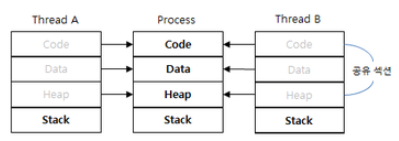

## Operating System  

 ### Thread와 Process   
  #### 스레드와 프로세스의 차이   
  - 스레드 : 프로세스가 할당받은 자원을 이용하는 실행 최소 단위   
  - 프로세스 : OS로부터 자원을 할당받은 작업 단위    
  - 프로세스는 프로그램이 메모리에 올라가 실행중인 상태를 뜻하며 Process ID를 가집니다.   
  - 프로세스는 단일스레드로 최초에 시작하고 하나의 프로세스에서 많은 동시 작업이 이루어져야하는 경우가 빈번히 발생합니다.  
  - 이에 따라 멀티 스레딩을 통해 하나의 프로세스에서 여러 작업이 진행될 수 있게 지원합니다.  

 

 #### 차이점
 
 ||스레드|프로세스|
 |-|-|-|
 |Code 공유|O|X|
 |Data 공유|O|X|
 |Stack 공유|X|X|
 |Heap 공유|O|X|  
 
   
 
 * code : 프로그램 코드 자체   
 * data : 정적 변수가 저장되는 영역   
 * stack : 로컬 변수나 매개(파라미터) 변수가 저장되는 영역  
 * heap : 동적으로 할당되는 변수가 저장되는 영역  
 
  
 
 > 프로세스는 서로 다른 프로세스의 자원에 대해 접근할 수 없습니다.   
 > 프로세스 간 통신 (IPC) 를 통해 프로세스 간 데이터를 주고 받을 수 있습니다.    
 > IPC 방식 : Message Queue, Pipe, Socket, Shared Memory 등이 있습니다.  
 > 프로세스는 기본적으로 서로의 프로세스에 영향을 미치지 않습니다.  
 > 스레드는 하나의 스레드에서 오류가 발생하면 같은 프로세스 내 동작하는 스레드 모두가 강제 종료될 수 있습니다.   
 
  
 
 #### 멀티 스레드의 장점 & 단점   
 
 __장점__  
 - Context-Switching 시 공유 메모리만큼의 자원을 아낄 수 있습니다.    
 > 멀티 프로세스의 경우 시분할 작업에서 프로세스가 변경되었을 때 캐싱되어 있는 현재 프로세스의 데이터에 대해 모두 Context-Switching 되어야하므로 오버헤드가 큽니다.   
 - 스레드는 프로세스 내 Stack 영역을 제외한 모든 메모리를 공유하므로 통신에 대한 부담이 적습니다.   
 
 ** Context-Switching : 현재 진행중인 Task 작업을 저장하고 다음 진행할 Task 데이터를 읽어오는 과정   
 ** Process Control Block으로 관리되는 현재 Task 정보는 Register에서 Process Ready Queue로 옮겨지고 다음 진행될 Task에 대한 정보가 Register로 올라옴으로써 Context-Switching이 완료됩니다.   
 ** 시분할 작업을 하는 이유 : 사용자에 대한 응답성을 높이기 위해, 여러 작업을 돌아가면서 거의 동시에 처리하기 위해    
 
 __단점__   
 - 스레드 간 공유되고 있는 변수에 대해 주의해야하며 스레드 에러 발생 시 같은 프로세스 내 모든 스레드가 종료됩니다.  
 - OS는 프로세스 단위까지만 관리하기 때문에 프로세스 내 멀티스레드에 대해서는 개발자, 관리자가 직접 제어해주어야 합니다.   
 - 데이터를 공유하기 때문에 반드시 동기화 문제가 발생하게 되어 이를 제어해주어야 합니다.   
   &nbsp; -> 웹 서버 환경에서 멀티스레드로 동작할 때 Singleton 객체를 생성함에 있어서 동기화 문제가 발생하지 않도록 Java(Synchronized)와 같은 키워드를 통해 제어해주어야 합니다.   
 
   
 
 ### Thread-Safe   
  #### 스레드 세이프란?  
  - 다양한 작업이 시분할되어 진행되는 멀티 스레드 환경에서 어떤 함수나, 변수, 객체가 여러 스레드로부터 동시에 접근이 이루어져도 프로그램 실행에 문제가 없도록 함을 의미합니다.   
  - 즉, 하나의 함수가 한 스레드로부터 호출되어 실행될 때, 다른 스레드가 해당 함수를 호출하여 동시에 해당 함수에 접근하더라도 각 스레드의 계산 결과가 서로에 대한 간섭없이 올바른 결과가 나오도록 하는 것입니다.   
  
  * Thread Safe를 위한 방법들   
  a. Thread Local Storage 활용 : 스레드에 독립적인 자원을 사용하여 계산을 진행함으로서 서로에 대한 주요 데이터 공유를 줄이는 방법(매개변수, 로컬변수 이용)    
  b. Mutual Exclusion(상호배제) : 뮤텍스 락이나 세마포와 같은 자원 접근 Lock 방법을 통해 공유 자원에 대한 동시 접근을 통제합니다.   
  c. Atomic Operation(원자적 수행) : 공유 자원에 접근할 때 Atomic한 연산을 통해 상호 배제(CS 구역 등에 대해)를 구현하여 공유 자원에 대한 동시 접근 통제.   
  
  ▶️ [내용](../../6.%20Design%20Pattern/jinu/README.md#싱글톤singleton)
  > 디자인 패턴의 Singleton 객체를 구현할 때 원자적으로 수행하는 방법과 코드를 명시해두었습니다.   
  > CS(Critical Section: 임계구역)은 공유 자원에 대한 독점 수행을 보장하는 영역을 뜻합니다. 커널 객체를 사용하지 않고 유저 모드 동기화를 지원합니다.   
  
   
  
  
  
