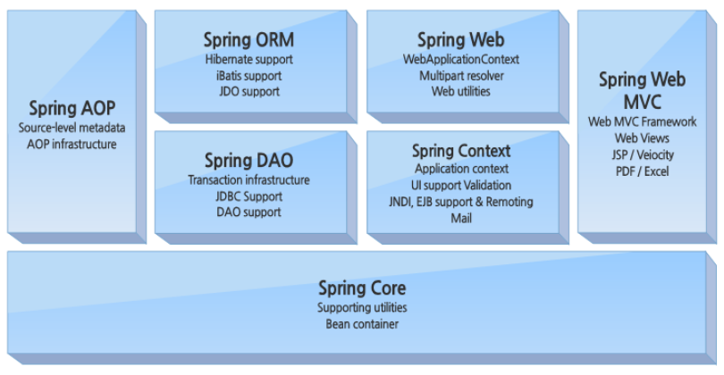
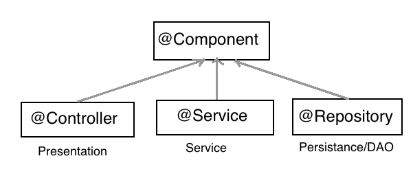
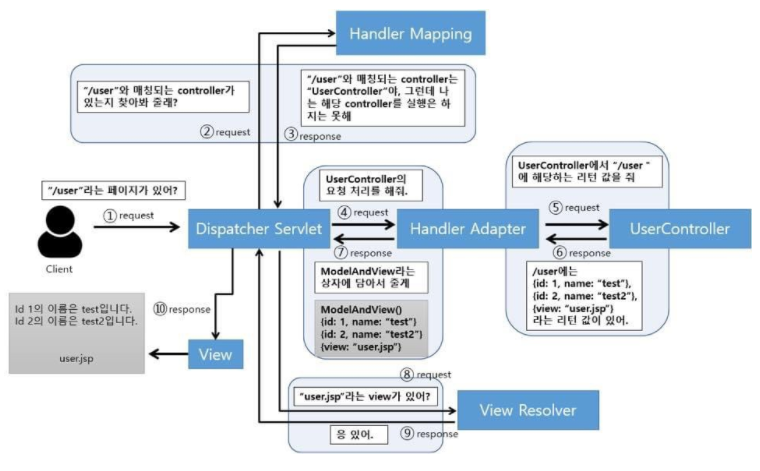
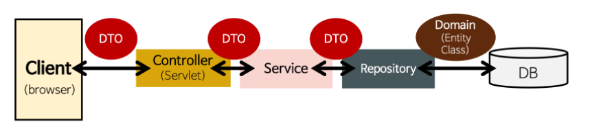
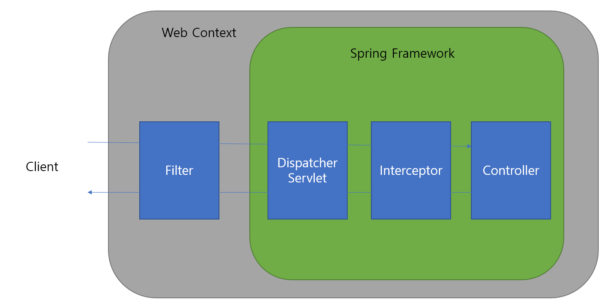

- https://blog.naver.com/jinwoo6612/222483423436   

## Spring   
   
 
 ### 스프링 프레임워크   
 - Java 플랫폼을 위한 오픈소스 애플리케이션 프레임워크  
 - 웹 애플리케이션 개발에 필요한 기능을 종합적으로 제공하는 경량화 솔루션  
 - 경량 컨테이너로서 java 객체를 직접 관리   
 - 전자정부 표준 프레임워크   

 <br>
 
 #### 특징  
 1.  IoC : 제어의 역흐름  
 2.  DI / DL : 의존성 주입  
 3.  POJO : 단순 오브젝트   
 4.  AOP : 관점 지향 프로그래밍   
 5.  MVC 1, 2패턴   
 
 <br>
 
 __제어의 역전 [Inversion of Control]__   
 - 객체 생성, 호출에 대한 모든 권한을 Spring Framework에 위임하여 위임 받은 Spring 객체에 의해 제어되게 됩니다.  
 - 즉, 개발자가 객체를 제어하는 것이 아닌 Spring에게 해당 역할( __객체 생성 -> 의존성 주입 -> 초기화 -> 소멸__ )을 맡기는 것  
 - Ex. new 객체 생성, 의존성 주입, 초기화, 소멸 작업 등등  
 - 장점1 : 개발자는 객체 관리에 대한 일을 Spring에 위임하고 비즈니스 로직 개발에 더욱 집중할 수 있다.  
 - 장점2 : 객체 간 의존 관계를 쉽게 변경가능  
 - 장점3 : 결론적으로 코드 재사용성, 유지보수성 증가  


<br>

 __의존성 주입 [Dependency Injection]__   
 - 의존성 주입은 제어의 역전 특징 중 하나의 하위 개념이다.  
 - 스프링 컨테이너가 특정 객체(Bean)에 다른 객체(Bean)와의 의존성을 맺어주는 행위  
 - 즉, 하나의 객체가 다른 객체를 사용할 수 있도록 연결짓는 것  
 - 3가지 DI 방식 : 필드 주입 / Setter 주입 / 생성자 주입  
 <br> 
 
 - 필드주입 : 코드는 가장 간단하지만 외부에서 변경이 불가능하므로 지양되는 주입 방식  
 ```
 @Autowired
 private ExampleServcie exampleService;
 ```
 <br>
 
 - Setter 주입 : Field 변수를 변경할 수 있는 Setter를 통해 의존성을 주입하는 방식 (주입 객체가 수정될 가능성이 있는 경우 사용)  
 ```
 private ExampleService exampleService;

 @Autowired
 public void setExampleService(ExampleService exampleService){
     this.exampleService = exampleService;
 }
 ```
 <br>
 
 - 생성자 주입 : 생성자를 호출하는 시점에 1회 주입하는 것이 보장, 생성자 1개만 있을 경우 @Autowired 생략 가능   
 _장점_   
 &nbsp; 1. 생성자 주입을 통해 주입 객체의 불변성 보장   
 &nbsp; 2. 생성자 주입을 통해 객체 1회 주입 보장  
 &nbsp; 3. 의존 객체에 final 키워드 사용 가능, 컴파일 시점에 누락된 객체 확인 가능   
 &nbsp; 4. 순환 참조 에러 방지 __(추후 정리하기!)__   
 &nbsp; 5. 생성자 파라미터로 의존성 객체를 받기에 개발자로부터 무분별한 객체 주입 방지    
 ```
 @Service
 
 public class ExampleServiceImpl implements ExampleService {
     private ExampleDAO exampleDAO;
     private SampleService sampleService;

     @Autowired    // 생성자가 1개만 있을 경우 @Autowired를 생략해도 주입이 가능
     public ExampleServiceImpl(ExampleDAO exampleDAO, SampleService sampleService) {
         this.exampleDAO = exampleDAO;
         this.sampleService = sampleService;
     }
 }

 @Controller
 public class ExampleController {

  private final ExampleService exampleService = new ExampleService(new ExampleDAO(), new SampleService());
 }
 ```

 *생성자 주입을 쓰자!!
 
 
 <br>
  
 __POJO : Getter/Setter를 포함한 단순 오브젝트__    
 - 특정 규약에 종속되지 않는 단순한 오브젝트   
 - 객체 지향의 개념을 준수합니다.  
 - 특정 환경에 종속되지 않습니다.  
 - > 객체 지향 프로그래밍에 적절합니다.   
 ```
 public home {
    private String name;
    private float[] location;
    private int price;

    public void setName(String name){
        this.name = name;
    }
    public void setLocation(float[] location){
        this.location = location;
    }
    public void setPrice(int price){
        this.price = price;
    }

    public String getName(){
        return this.name;
    }
    public float[] getLocation(){
        return this.location;
    }
    public int getPrice(){
        return this.name;
    }
    
 ```
 
 <br>
 
 __AOP : 관점 지향 프로그래밍__   
 - 관심사가 같은 데이터를 한 곳에 모아 관리하고 낮은 결합도 높은 응집도를 갖도록 독립접인 모듈로 캡슐화하는 것을 의미  
 - 개발 과정 중복되는 코드가 발생하게 되고 이를 보완하기 위해 AOP가 등장했습니다.   
 - 핵심기능과 공통기능을 분리 -> 공통 기능에 대해서 재사용 될 수 있도록 분리해두고 핵심 로직에 영향을 끼치지 않도록 기능을 끼워넣는 형태로 사용    
 - 재사용성 극대화 -> 프로그래밍/개발 속도 증대  

 <br>

 __Spring Framework 구조__   
 
    
 
 - Spring Core : Spring Framework 핵심 기능 제공, 주요 컴포넌트 BeanFactory   
 - Spring Context : 애플리케이션 생명주기 이벤트와 같은 다수 엔터프라이즈 서비스 제공    
 - Spring AOP : Aspect 지향 프로그래밍 기능을 Spring Framework와 통합하여 모든 객체에서 AOP 사용 가능    
 - Spring DAO : 서로 다른 DB 벤더들의 예외 핸들링, JDBC DB 접근, 트랜젝션 전반 관리   
 - Spring ORM : 다양한 ORM 프레임워크(JPA, Mybatis)에 플러그인 되어 Object Relational 툴 제공   
 - Spring Web Module : 웹 기반 애플리케이션 Context 제공, 다중 요청 핸들링   
 - Spring MVC Framework : 완전한 기능을 갖춘 MVC 패턴    


 <br>
 <br>
 
 ### MVC 패턴  
 - MVC : 웹 애플리케이션 개발에 있어 가장 많이 정형적으로 쓰이는 디자인 패턴   
 - Model, View, Controller    
 - Model : 데이터 처리를 담당, Service & DAO 영역으로 나누어집니다.  
 - View : 사용자에게 보여지는 부분, 사용자 인터페이스 담당, JSP & Vue & React    
 - Controller : Model, View 연결 담당, 전반적 서비스 제어 담당, Controller    

 <br> 
 
 - MVC1 패턴    
  

  
 - MVC2 패턴   
  
 
 <br>
 
 [View - Controller - Model]   
  
 <br><br>
  
 ### Spring VS Spring Boot   
 - Spring Framework와 Spring Boot Framework 차이점과 특징<설정 자동화>   
 가장 큰 차이점!  
 &nbsp; - 스프링의 경우 AOP, DI, DL, POJO 특징을 가지고 웹 애플리케이션 개발을 위한 다양한 기능을 갖추고 있지만 기본 프로젝트 세팅에 있어 개발자에게 많은 시간 투자를 필요로 합니다.   
 &nbsp; - 스프링 부트의 경우 복잡한 프로젝트 설정을 자동화하고 @AutoConfiguration을 통해 애플리케이션 개발에 필요한 모든 내부 Dependency를 관리합니다.   
 
 <br>
 
 __Spring Boot__  
 - Spring MVC 사용시 Component Scan, Dispatcher Servlet, View Resolver 등 설정을 간단하게 설정할 수 있도록 합니다.   
 - Spring 프레임워크 설정의 많은 부분을 Boot가 자동화하여줍니다.   
 - Spirng과는 달리 Spring Boot 내장 WAS(Default: Tomcat)를 통해 서버를 실행할 수 있습니다.  (Jetty(경량 & 소규모), Undertow(대규모 & 안정적))  
 - Spring-Boot-Starter는 의존성 및 설정, 버전 호환을 자동화하여주는 모듈입니다.   
 - > spring-boot-starter-jpa : spring-aop, spring-jdbc 의존성을 자동으로 설정  
 
 <br><br>
 
 ### Bean   
  #### Bean?  
  - Spring IoC 컨테이너가 관리하는 자바 객체를 Bean 이라고 합니다.   
  - Spring IoC는 객체(Bean)에 대한 제어권을 가지고 있습니다.   
  - new 를 통해 생성한 객체는 Bean이 아닙니다.  
  - ApplicationContext.getBean()으로 얻어질 수 있는 객체를 Bean 이라고 합니다.  


  즉, Spring에서 Bean는 Spring 컨테이너가 알고 있는 객체를 의미합니다.   
  
  <br> 
  
  Spring 컨테이너에 Bean 객체를 등록하는 방법?   
  1. Component Scan 을 통해 등록   
  2. Bean 설정 파일에 직접 Bean 정보를 등록   
  
  <br>
  
  1) __Component Scan__   (in Spring Boot)
  - 방법 : @ComponentScan 어노테이션과 @Component(Controller, Service, Repository)를 통해 Bean 등록   
     
  @ComponentScan : Component로 등록할 객체를 찾을 범위(Scope)를 알려주는 역할  
  @Component : 실제 Bean으로 등록할 객체(클래스)를 의미    
  
  Spring Boot의 경우 @SpringBootApplication 어노테이션 내부적으로 @ComponentScan을 포함합니다.   
  @SpringBootApplication : @ComponentScan + @EnableAutoConfiguration + @SpringBootConfiguration   
  
  <br> 
  
  (in Spring)  
  - xml bean 설정 파일 등록  
  ```
  <?xml version="1.0" encoding="UTF-8"?>
  <beans xmlns="http://www.springframework.org/schema/beans"
        xmlns:xsi="http://www.w3.org/2001/XMLSchema-instance"
        xmlns:context="http://www.springframework.org/schema/context"
        xsi:schemaLocation="http://www.springframework.org/schema/beans http://www.springframework.org/schema/beans/spring-beans.xsd
              http://www.springframework.org/schema/context http://www.springframework.org/schema/context/spring-context-3.2.xsd">

      <bean id="dog" class="com.spring.Dog">
          <property name="myName" value="poodle"></property>
      </bean>

      <bean id="cat" class="com.spring.Cat">
          <property name="myName" value="bella"></property>
      </bean>

      <bean id="petOwner" class="com.spring.PetOwner" scope="singleton">
          <constructor-arg name="animal" ref="dog"></constructor-arg>
      </bean>
  </beans>
  ```
  
  <br>
  
 2)  __Bean 설정 파일에 Bean을 직접 등록__  
  - 방법 : 자바 클래스를 생성하여 xxxConfiguration 과 같이 명명한 객체에 @Configuration 어노테이션을 붙여줌으로써 직접 Spring Bean 설정을 진행합니다.  
  Bean을 직접 등록하면 객체에 @Component 어노테이션을 붙이지 않아도 됩니다.  
  ```
  @Configuration
  public class SampleConfiguration {
      @Bean     // Bean 등록  
      public SampleController sampleController() {
          return new SampleController;
      }
  }
  ```
  
  <br>
  
  #### Spring Container에 등록된 Bean은 의존성 주입을 통해 주입되거나 관리, 소멸 됩니다.   
  #### Bean은 기본적으로 Singleton 형태로 존재합니다. (scope 설정 가능. Ex. scope="prototype")   
  **Singleton** : 객체를 계속해서 생성하는 것이 아닌 최초 1회만 할당하여 사용하는 디자인 패턴, Container 내 단 하나의 객체만 존재   
  **Prototype** : Container 내 하나의 Bean 정의에 대해 다수 객체가 존재 가능  
  ```
  // Singleton Design 
  
  private static SampleComponent sampleComponent = null;
  
  public static getInstance SampleComponent() {
    if(sampleComponent == null){
      sampleComponent = new SampleComponent();
    }
    return sampleComponent;
  }
  
  ```
  
  <br><br> 
  
 ### Container  
  #### Container?  
  - Spring Container는 개발자 대신 인스턴스 Life Cycle을 관리하고 객체의 생성, 주입, 소멸을 제어합니다.   
  - Java 객체(Bean)를 담고있습니다.  
  - Bean 생명 주기 관리  
  - 애플리케이션을 구성하는 Bean을 관리하기 위해 Inversion Of Control 특징을 가집니다.   
  
  <br> 
  
  __1. Bean Factory__   
    
  
  1. Bean 객체를 생성, 관리하는 클래스  
  2. Factory Pattern의 구현체  
  3. getBean()이 호출되면 Factory는 의존성 주입을 위해 Spring Container가 가지고 있는 Bean을 인스턴스화하고 Bean 생성 & 설정 시작   
  4. Bean 의존성 주입  
  > getBean()메소드를 호출하면 Bean Factory는 Bean을 인스턴스화 및 설정하여 생성된 Bean을 반환합니다.  
  ```
   final BeanFactory beanFactory = new AnnotationConfigApplicationContext(AppConfig.class);
   final SampleService sampleService = beanFactory.getBean("sampleService", SampleService.class);
   final Ret ret = sampleService.method1(parameter1, parameter2);
  ```
  
  <br> 
  
  __2. Application Context__   
  1. Bean Factory에서 확장 및 향상된 컨테이너  
  2. Bean Factory의 기본 기능을 포함하며 Spring이 제공하는 부가 서비스를 추가적으로 제공합니다.   
  3. Bean Factory와 달리 Context 초기화 시점에 모든 Singleton Bean을 미리 로드한 후 애플리케이션을 시동하며 이후 Bean을 바로바로 가져올 수 있습니다.   
  
  > Bean Factory(getBean())와 Appliation Context(Context 초기화)의 Bean 생성 및 로드 시점이 서로 다릅니다.  
  * Context 초기화 시점 : Servlet, Listener, Filter 등 초기화 시점  
  * @PostConstruct : 특정 클래스 내 메소드에 붙여 사용하며, 객체 내 모든 Bean이 초기화 된 직후 최초 1회 실행을 보장합니다.(비즈니스 로직 중 초기 설정에 주로 사용)   
 
  <br><br> 
  
 
 ### MVC2 패턴과 Spring 설정 파일들 + Client 요청부터 응답까지 흐름   
 
 MVC2  
   
 
 <br>
 
 - servlet-context.xml : Servlet에서 요청과 관련된 객체를 정의합니다 / Controller, ViewResolver, Interceptor, MultipartResolver, HandlerMapping 등 설정을 합니다.  
 - root-context.xml : View와 관련되지 않은 객체를 정의합니다 / Service, Repository, DB 등 비즈니스 로직 관련 설정을 합니다.  
 - web.xml : WAS 관련 설정을 적용하기 위한 설정파일 / WAS가 최초 구동 시 각종 설정을 정의해줍니다 / 타 xml 파일을 인식하도록 각 xml 설정파일 위치를 알려줍니다.  

 - View Resolver : View(JSP)를 선택하는 것은 Controller인데 컨트롤러에서 매번 뷰를 생성하는 것은 비효율적이므로 Spring에서 해당 작업을 분리시켜 View Resolver가 탄생했습니다.  
        -> Controller는 View의 논리적 이름만 반환하고 Dispatcher Servlet의 View Resolver가 받아서 사용할 View 객체를 찾고 생성하는 작업을 대신 진행합니다.   
        -> View Resolver 는 View 객체를 캐싱하고 있기에 반복적으로 View를 생성하지 않아도 되는 장점이 있습니다.   
 ```
 <bean class="org.springframework.web.servlet.view.InternalResourceViewResolver">
    <property name="prefix" value="/WEB-INF/view" />
    <property name="suffix" value=".jsp" />
 </bean>     // View Resolver는 Controller로부터 View 이름을 받아 prefix, suffix를 붙여 해당 View를 생성합니다.  
 ```
 
 - Dispatcher Servlet : http 프로토콜 모든 요청을 가장 먼저 받는 곳이며 적합한 컨트롤러로 위임해주는 역할을 합니다. Front Controller로 정의할 수 있습니다.  
 - ComponentScan : Component를 Scan할 범위 설정  

 > Dispatcher Servlet에서 요청을 처리하는 Routine   
 

 
 <br><br> 

 ### DAO와 DTO   
 
  <br>
  
 __DAO : Data Access Object__ 로 DB에 접근하는 객체입니다, Service Layer와 Persistance Layer사이를 연결하는 역할을 합니다.    
 > Mybatis Framework : DAO 객체를 통해 Mapper class를 이용하여 Service ~ DB 통신  
 > JPA Framework(ORM) : Model Entity를 통해 DB 객체를 Mapping하고 Repository 객체를 통해 DB와 통신   
 
 <br>
 
 JDBC DAO(Plain JDBC API 이용)  
 ```
 public dto methodDao(String id) throws SQLException {
   String sql = "select id, num from test where id=?";
   Connection conn = null;
   PreparedStatement pstmt = null;
   ResultSet rset = null;
   TestDTO dto = null;

   try {
       conn = ds.getConnection();
       pstmt = conn.prepareStatement(sql);
       pstmt.setString(1, id);
       rset = pstmt.executeQuery();

       if(rset.next()){
           dto = new TestDTO(rset.getString(1), rset.getInt(2));
       }
   }finally{
       if(rset!=null) rset.close();
       if(pstmt!=null) pstmt.close();
       if(conn!=null) conn.close();
   }
   return dto;
 }
 ```
 
 <br>
 
 __DTO : Data Transfer Object__ 로 계층간 데이터 교환을 위한 역할을 합니다. DB에서 조회한 데이터를 저장하는 Entity를 통해 만든 일종의 Wrapper 객체   
 > 계층간 데이터 교환을 위한 객체이므로 특별한 로직을 가지지 않고 순수한 POJO 형식의 객체입니다.  
 > VO와 DTO의 차이: VO와 DTO는 같은 개념이지만 DTO는 계층간 데이터 교환, VO는 읽기만 가능한 Read-Only 객체로서 데이터 자체에 의미를 두고 있다는 점이 다릅니다.   
 
 
 
 ```
 package model.dto;

 @Getter
 @Setter
 @Builder
 public class TestDTO {
     private String id;
     private int num;
 }

 ```

 <br><br>  

### Spring JDBC 활용   
 - Plain JDBC API와 달리 Spring JDBC를 통해 DB Access를 보다 쉽게 할 수 있습니다.   
 - JDBC : Java Database Connectivity, DB에 접근할 수 있도록 Java에서 제공하는 API    
 - JDBC Driver : Java 프로그램 요청을 DBMS가 이해할 수 있는 통신 프로토콜로 변환해주는 Adapter, DBMS 마다 상이     
 <br> 
 
 - Spring JDBC가 대신해주는 일   
 1. Connection Pool(DataSource가 관리) 객체 생성, 소멸   
 2. ResultSet 조회 결과 처리  
 3. 예외 처리   
 4. JDBCTemplate을 통한 Select, Insert, Update, Delete 작업 처리  
 
 <br> 
 
 - DataSource : JDBC의 일부로서 일반화된 DB 연결 Factory 입니다. DB Connection 정보를 가지고 있으며 Spring에서 Bean(객체)으로 등록하게 됩니다. 이후 Spring은 DataSource를 통해 DB와 연결을 할 수 있습니다.   
 - DataSource : JDBC Driver 벤더(Oracle, Mysql, Postgre)에 따라 여러가지로 존재합니다.    
 - DataSource 역할   
  > DB와 연결   
  > Connection Pool 기능(DB Connection을 미리 생성해두었다가 요청 시 즉시 꺼내어 사용하는 방식 )     
  > Transaction 처리   
 
 <br>
 
 - DataSource 이용하는 방법   
 
 > 의존성 : Spring JDBC, common-dbcp, mysql connector, transaction    
 ```
 <dependency>
    <groupId>org.springframework</groupId>
    <artifactId>spring-jdbc</artifactId>
    <version>${org.springframework-version}</version>
 </dependency>
 <dependency>
    <groupId>commons-dbcp</groupId>
    <artifactId>commons-dbcp2</artifactId>
    <version>2.1.1</version>
 </dependency>
 <dependency>
    <groupId>mysql</groupId>
    <artifactId>mysql-connector-java</artifactId>
    <version>5.1.45</version>
 </dependency>
 <dependency>
    <groupId>org.springframework</groupId>
    <artifactId>spring-tx</artifactId>
    <version>${spring.version}</version>
 </dependency>
 ```
 
 > .properties file  
 ```
 jdbc.driver = com.mysql.jdbc.Driver 
 jdbc.url = jdbc:mysql//localhost:3306/databaseSchema 
 jdbc.username = root
 jdbc.password = 1234
 ```
 
 > root-context.xml (DB 설정 파일) , Spring Bean으로 등록  
 ```
 <context:property-placeholder location="com/spring/props/jdbc.properties"/>
 
 <bean id="dataSource" class="org.apache.commons.dbcp.BasicDataSource" destroy-method="close">
       <property name="driverClassName" value="${jdbc.driverClassName}" />
       <property name="url" value="${jdbc.url}" />
       <property name="username" value="${jdbc.username}" />
       <property name="password" value="${jdbc.password}" />
 </bean>
 ```
 <br><br> 
 
 ### Filter와 Interceptor   
  #### Filter : Dispatcher Servlet 요청 전/후로 url 패턴에 따라 부가적인 작업을 할 수 있습니다.   
  #### Interceptor : Spring 제공 기술로 Dispatcher Servlet에 요청이 닿은 후 url 패턴에 맞는 Controller 호출 전/후에 부가적인 작업을 할 수 있습니다.   
  
 
 
 
  __Filter__
  
  - WAS 수준의 Web Container에 의해 관리됩니다.   
  - Spring Framework와 무관하게 전역적으로 처리해야할 작업을 수행합니다.   
  > 사용 예 : 문자 Encoding, 요청에 대한 보안작업(XSS Protect), 데이터 압축    
  - init : 객체 초기화 & 서비스에 추가하기 위한 메소드, 최초 1회 init 메소드를 통해 필터 객체를 초기화하고 이후 doFilter를 통해 처리합니다.   
  - doFilter : url Pattern에 맞는 모든 http 요청이 Dispatcher Servlet에 전달되기 전/후에 실행되는 메소드입니다.(인코딩 설정 주로 사용)   
  - destroy : 필터 객체를 서비스에서 제거하는 메소드입니다. 호출 이후부터는 doFilter가 처리되지 않습니다.    
 
  ```
  public interface Filter {
     public default void init(FilterConfig filterConfig) throws ServletException {}
   
   
     public void doFilter(ServletRequest request, ServletResponse response,
       FilterChain chain) throws IOException, ServletException;
       
     public default void destroy() {}
     
  }
  ```
 <br>
 
 
 __Interceptor__
 
 - Spring Context에서 동작합니다.  
 - Client의 요청과 관련하여 Spring Context에서 전역적으로 처리할 작업을 수행합니다.   
 > 사용 예 : 인증/인가 검증작업, Controller로 넘기는 데이터 가공, 로깅   
 - PreHandle : Controller 호출 전 실행되며 return 값에 따라 Controller로 요청이 이어질지 결정됩니다.(사용자 인증에 주로 사용)   
 - PostHandle : Controller 호출 후 실행되며 ModelAndView 타입 정보가 제공됩니다.   
 - afterCompletion : 모든 작업이 완료된 후 실행 (사용한 리소스 반환 필요 시 사용)
 ```
 public interface HandlerInterceptor {
    default boolean preHandle(HttpServletRequest request, HttpServletResponse response, Object handler)
        throws Exception {
        
        return true / false;
    }
  
    default void postHandle(HttpServletRequest request, HttpServletResponse response, Object handler,
         @Nullable ModelAndView modelAndView) throws Exception {
         
    }
    
 ```
 
 
 
