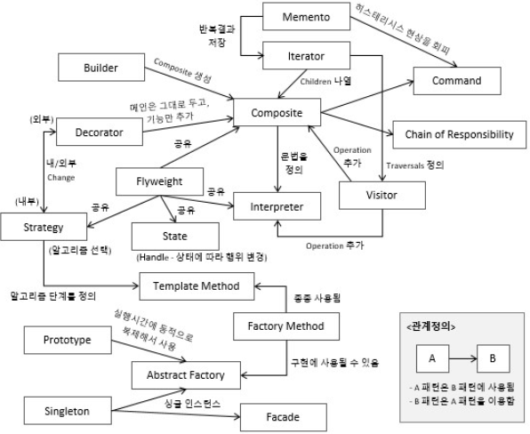

## 디자인 패턴

    

### Design Pattern의 개념   
 #### Design Pattern : SW 개발에 사용되는 디자인 패턴은 프로그램 개발(로직, 데이터 구조)에 자주 발생하는 문제를 해결하기 위한 방법들 중 하나입니다.    
  > 과거 다양한 설계 노하우들을 축적하며 이러한 방식에 이름을 붙힌 형태로 많은 디자인 패턴이 존재합니다.     
  > 즉, SW 설계 시 개발 과정의 특정 부분에 반복적으로 발생하는 문제를 정리하여 상황에 맞게 해결할 수 있도록 정형화된 솔루션!    
 
  

 #### 디자인 패턴의 구조   
 i. Context : 문제가 발생하는 상황으로 패턴이 적용될 수 있는 상황을 뜻합니다.  
 ii. Problem : 패턴이 적용되어 해결될 필요가 있는 디자인 이슈들을 뜻합니다.  
 iii. Solution : 문제 해결을 위한 템플릿으로서 디자인 패턴을 구성하는 요소 및 협력 관계를 뜻합니다.  
  
 #### 디자인 패턴을 사용하는 이유?   
 - 재사용성이 가능한 설계   
 - 패턴을 통해 시스템 유지보수성을 높일 수 있습니다.  
 - 올바른 설계를 신속히 할 수 있도록 설계자에게 도움을 줍니다.   
 
  
 
 효율적인 로직을 설계하기 위한 방법론의 종류  
 
### Design Pattern의 종류   
 #### 3가지 패턴  
 i. 생성 패턴 : 객체 생성 관련 디자인 패턴   
 ii. 구조 패턴 : 객체를 조합하여 큰 구조 설계를 위한 디자인 패턴  
 iii. 행위 패턴 : 객체가 혼자 수행할 수 없는 작업을 여러 객체로 분리시키면서 낮은 결합도를 유지하는데 중점을 둔 디자인 패턴    
 
 |__생성 패턴__|구조 패턴|행위 패턴|
 |:-:|:-:|:-:|
 |Singleton(싱글톤)|Adaptor(어댑터)|Strategy(전략)|
 |Factory Method(팩토리 메소드)|Bridge(브릿지)|Template Method(템플릿 메소드)|
 |Abstract Factory Method|Composite(컴포지트)|Observer(옵저버)|
 |Builder(빌더)|Decorator(데코레이터)|State(스테이트)|
 |Prototype(프로토타입)|Facade(퍼사드)|Visitor(비지터)|
 ||Flyweight|Command(커맨드)|
 ||Proxy(프록시)|Interpretor(인터프리터)|
 |||Iterator(이터레이터)|
 |||Memento(메멘토)|
 
  
 
 
 - 대표적 패턴 요약   
 
 생성패턴  
 > 싱글톤 : 전역 변수를 사용치 않고 객체 하나만 최초로 생성토록하여 생성된 하나의 객체를 어디서든지 참조할 수 있도록 한 패턴   
 > 팩토리 메소드 : 객체 생성 처리를 서브 클래스로 분리하여 캡슐화한 패턴, 객체 생성 방법을 알 필요 없이 객체 생성 메소드 호출    
 
 구조패턴  
 > 컴포지트 : 여러 개 객체들로 구성된 복합 객체와 단일 객체를 클라이언트에서구별 없이 다룰 수 있도록 한 패턴   

 행위 패턴  
 > 옵저버 : 객체의 상태 변화에 따라 다른 객체의 상태로 같이 연동되도록 1:多 의존 관계를 구성하는 패턴  
 > 스테이트 : 객체의 상태에 따라 객체 행위 내용을 변경하는 패턴   

  
  
 
### 싱글톤(Singleton)  
 #### Singleton : 객체 하나만 최초로 생성토록하여 해당 객체를 어디서든지 참조할 수 있도록 만든 구조입니다.    
  
 - 객체(인스턴스)가 단 1개만 생성되어야 하는 경우에 사용되는 패턴   
 - Ex. 레지스트리 파일의 경우 객체가 여러개 생성되면 설정값이 변경될 위험성 존재 -> 싱글톤을 설계할 때, 동시성 문제를 고려해서 설계해야합니다.   
 - Spring Framework의 경우 Bean 객체를 생성할 때 Scope 기본값은 Singleton 입니다. (옵션 : Prototype(빈 요청마다 객체 생성), Request[요청당 객체 생성])   

   
 
 자바 싱글톤 구현 방식   
 i. 이른 초기화 : static 키워드를 이용하여 정적 바인딩을 통해 메모리에 미리 올려두는 방식입니다.  
 * static : 컴파일 시점에 메모리에 로드   
 ii. 
