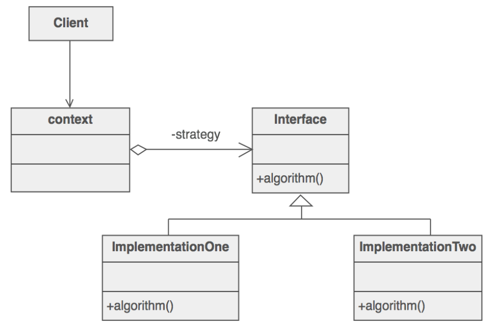

## 디자인 패턴

<br>   


### Design Pattern의 개념   
 #### Design Pattern : SW 개발에 사용되는 디자인 패턴은 프로그램 개발(로직, 데이터 구조)에 자주 발생하는 문제를 해결하기 위한 방법들 중 하나입니다.    
  > 과거 다양한 설계 노하우들을 축적하며 이러한 방식에 이름을 붙힌 형태로 많은 디자인 패턴이 존재합니다.     
  > 즉, SW 설계 시 개발 과정의 특정 부분에 반복적으로 발생하는 문제를 정리하여 상황에 맞게 해결할 수 있도록 정형화된 솔루션!    
 
 <br>

 #### 디자인 패턴의 구조   
 i. Context : 문제가 발생하는 상황으로 패턴이 적용될 수 있는 상황을 뜻합니다.  
 ii. Problem : 패턴이 적용되어 해결될 필요가 있는 디자인 이슈들을 뜻합니다.  
 iii. Solution : 문제 해결을 위한 템플릿으로서 디자인 패턴을 구성하는 요소 및 협력 관계를 뜻합니다.  
  
 #### 디자인 패턴을 사용하는 이유?   
 - 재사용성이 가능한 설계   
 - 패턴을 통해 시스템 유지보수성을 높일 수 있습니다.  
 - 올바른 설계를 신속히 할 수 있도록 설계자에게 도움을 줍니다.   
 
 <br>
 
 효율적인 로직을 설계하기 위한 방법론의 종류  
 
### Design Pattern의 종류   
 #### 3가지 패턴  
 i. 생성 패턴 : 객체 생성 관련 디자인 패턴   
 ii. 구조 패턴 : 객체를 조합하여 큰 구조 설계를 위한 디자인 패턴  
 iii. 행위 패턴 : 객체가 혼자 수행할 수 없는 작업을 여러 객체로 분리시키면서 낮은 결합도를 유지하는데 중점을 둔 디자인 패턴    
 
 |__생성 패턴__|구조 패턴|행위 패턴|
 |:-:|:-:|:-:|
 |Singleton(싱글톤)|Adaptor(어댑터)|Strategy(전략)|
 |Factory Method(팩토리 메소드)|Bridge(브릿지)|Template Method(템플릿 메소드)|
 |Abstract Factory Method|Composite(컴포지트)|Observer(옵저버)|
 |Builder(빌더)|Decorator(데코레이터)|State(스테이트)|
 |Prototype(프로토타입)|Facade(퍼사드)|Visitor(비지터)|
 ||Flyweight|Command(커맨드)|
 ||Proxy(프록시)|Interpretor(인터프리터)|
 |||Iterator(이터레이터)|
 |||Memento(메멘토)|
 
 <br>
 
 
 - 대표적 패턴 요약   
 
 생성패턴  
 > 싱글톤 : 전역 변수를 사용치 않고 객체 하나만 최초로 생성토록하여 생성된 하나의 객체를 어디서든지 참조할 수 있도록 한 패턴   
 > 팩토리 메소드 : 객체 생성 처리를 서브 클래스로 분리하여 캡슐화한 패턴, 객체 생성 방법을 알 필요 없이 객체 생성 메소드 호출    
 
 구조패턴  
 > 컴포지트 : 여러 개 객체들로 구성된 복합 객체와 단일 객체를 클라이언트에서구별 없이 다룰 수 있도록 한 패턴   

 행위 패턴  
 > 옵저버 : 객체의 상태 변화에 따라 다른 객체의 상태로 같이 연동되도록 1:多 의존 관계를 구성하는 패턴  
 > 스테이트 : 객체의 상태에 따라 객체 행위 내용을 변경하는 패턴   

 <br>
 <br>
 
### 싱글톤(Singleton)  
 #### Singleton : 객체 하나만 최초로 생성토록하여 해당 객체를 어디서든지 참조할 수 있도록 만든 구조입니다.    
  
 - 객체(인스턴스)가 단 1개만 생성되어야 하는 경우에 사용되는 패턴   
 - Ex. 레지스트리 파일의 경우 객체가 여러개 생성되면 설정값이 변경될 위험성 존재 -> 싱글톤을 설계할 때, 동시성 문제를 고려해서 설계해야합니다.   
 - Spring Framework의 경우 Bean 객체를 생성할 때 Scope 기본값은 Singleton 입니다. (옵션 : Prototype(빈 요청마다 객체 생성), Request[요청당 객체 생성])   
 - 단 한번만 생성되어 사용되어야 하는 객체가 필요할 때 Singleton 패턴을 사용하며 예시로는 1대의 프린터 공유가 있습니다.

 <br> 
 
 자바 Singleton 구현 방식   
 
 i. Eager Initializing(이른 초기화) : static 키워드를 이용하여 정적 바인딩을 통해 메모리에 미리 올려두는 방식입니다.   
 > static : 컴파일 시점에 메모리에 로드   
 > 클래스가 최초로 로딩될 때 객체가 생성되므로 Thread-Safe 합니다.  
 
 ii. 'Synchronized' initialization(게으른 동기화 블럭) : 메소드에 동기화 Block을 지정하여 Thread-Safe Singleton을 보장합니다.  
 > 객체(인스턴스)가 필요한 시점에 요청하여 동적으로 런타임에 객체를 생성하는 방식입니다.  
 > 따라서, 객체 생성 여부와 상관 없이 무조건 객체를 가져오기 위해서 Synchronized Block을 거쳐야합니다. -> 속도가 느립니다.   
 
 iii. DCL(Double Checked Locking) : 동기화 블럭 방식이며 객체가 생성되지 않은 경우만 동기화 블럭을 실행하는 구조입니다.     
 > 여러 Thread 들의 접근에 대해 Double Checking을 하므로 Thread Safe 하다고 생각할 수 있지만 내부적으로 Assembly 코드 단계로 내려가면(CPU 명령어 수행 단계) 안전하지 않다는 것을 알 수 있습니다. 
 > 'volatile' 키워드를 사용하여 해당 문제를 해결할 수 있다고 하지만 여전히 재배치문제(컴파일된 소스코드의 순서가 재배치되는 현상)로 Thread Safe 하지 않다고 합니다.  
 
 iv. Lazy Holder(게으른 홀더) : 키워드 사용없이 동시성 문제를 해결하는 방식으로 런타임에 객체(Inner Class) 초기화를 통해 원자성을 보장하는 Singleton 구조입니다.   
 > 키워드를 사용하지 않음으로서 성능이 뛰어나고 자바 진영에서 많이 사용되는 싱글톤 구현 방식입니다.  

 <br>
 
 Singleton 구현 방법과 설명(Java)
 ```
 // Eager Initialization
 // : static 정적 바인딩을 통해 컴파일 시점에 객체가 최초로 생성되며 getInstance() 메소드를 통해 객체에 접근하게 됩니다.  
 public class Singleton {
    private static Singleton uniqueInstance = new Singleton();

    private Singleton() {}

    public static Singleton getInstance() {
      return uniqueInstance; 
    } 
 }
 
 * 컴파일 시점에 메모리에 객체가 이미 생성되어 있는 상태이므로 Thread 여러개가 동시에 getInstance() 메소드를 호출해도 안전합니다.  
 
 ---------------------------
 
 // Lazy Initialization with Synchronized  
 // : Synchronized 키워드를 이용한 동기화 블럭 구현 방식으로 객체를 호출하는 시점에 객체 생성여부를 확인하고 Singleton 객체를 반환합니다.   
 public class Singleton {
    private static Singleton uniqueInstance;

    private Singleton() {}

    public static synchronzied Singleton getInstance() {
      if(uniqueInstance == null) {
         uniqueInstance = new Singleton();
      }
      return uniqueInstance;
    }
  }
  
  * getInstance() 메소드에 synchronized 키워드를 사용하여 Thread가 동시에 호출하더라도 1 Thread 씩 메소드를 실행하여 객체를 반환하므로 Thread Safe 합니다.  
  
  ---------------------------
  
  // Double Checked Locking 
  // : 인스턴스가 생성되지 않은 경우에만 Synchronized 키워드 블럭이 실행되는 구조입니다.  
  public class Singleton {
    private volatile static Singleton uniqueInstance;
    
    private Singleton() {}
    
    public static Singleton getInstance() {
      if(uniqueInstance == null){
        synchronized(Singleton.class) {
          if(uniqueInstance == null) {     // double check
            uniqueInstance = new Singleton();
          }
        }
      }
      return uniqueInstance;
    }
  }
  
   * Time Sharing Machine의 멀티스레드 환경에서 DCL Singleton 방식 <- 이론적으로는 맞으나 실제 환경에서는 안전하지 않다.
   <이론>
   1. T1은 getInstance()메소드를 통해 객체를 반환받으려 합니다.
   2. T1은 instance가 null이므로 synchronized 블럭으로 넘어갑니다.
   3. T1은 T2에게 선점됩니다. (T2 차례)
   4. T2가 getInstance()메소드를 통해 객체를 반환받으려 합니다.
   5. T2는 instance가 null이므로 synchronized 메소드로 들어가려 시도합니다.
   6. 하지만, T1이 synchronized lock을 가지고 있기에 T2는 대기합니다.  
   7. T2는 T1에 의해 선점됩니다. (T1 차례)
   8. T1는 if()절을 만족하므로 uniqueInstance에 객체를 할당받습니다. 
   9. T1는 Synchronized 블록을 종료하고 객체를 반환하면서 lock을 반환합니다. 
   10. T1는 T2에 의해 선점됩니다. (T2 차례) 
   11. T2는 synchronized 블럭으로 들어가 instance가 null인지 검사합니다.
   12. instance에 Singleton 객체가 담겨있기에(not null) 두번째 Singleton 객체는 만들어지지 않고 T1에 의해 만들어졌던 Singleton 객체를 바로 반환합니다.  
   
   -> 그렇다면 Thread Unsafe한 이유는??
    -> T1이  uniqueInstance = new Singleton(); 에서 객체를 생성하려는 시점(객체 생성자가 완전히 실행되지 않은상태)에 T2에 선점되고 T2는 uniqueInstance를 검사하는데 이때는 null이 아니므로 완전히 생성되지 않은 Singleton 객체를 반환해버리는 현상이 발생할 수 있습니다.
     -> RAM 메모리의 객체가 CPU(레지스터)를 통해 가지고와서 객체 초기화(EX단계) 후 RAM으로 다시 전달되는 과정을 거쳐야 객체가 생성되는 것인데 'Synchronized'키워드는 해당 작업에 대한 원자성을 보장할 수 없으며 멀티코어CPU 에서는 각각의 전용 레지스터를 가지므로 레지스터의 데이터를 검사하더라도 일관성 문제가 발생할 수 있습니다. 
     
  ----------------------------
  
  // Lazy Holder 
  // 별도의 키워드 없이 Thread Safe한 Singleton을 구현하는 방식으로 동적 바인딩을 이용하는 구조입니다.  
  public class Singleton {
    private Singleton() {}

    // inner class인 InnerInstanceClazz
    private static class InnerInstanceClazz() {
        private static final Singleton uniqueInstance = new Singleton(); // InnerClass 초기화 과정에서 JVM이 Thread-Safe하도록 instance를 생성 
    }

    public static Singleton getInstance() {
        return InnerInstanceClazz.instance;
    }
  }
  /*
  InnerInstanceClazz 내 변수가 없기에 static으로 선언된 클래스여도 클래스 로더가 컴파일 시점에 클래스를 초기화하지 않고 getInstance() 메소드를 통해 호출될 때 초기화되게 됩니다.
  즉, 동적 바인딩(런타임에 객체 생성)을 통해 스레드마다 객체를 1개씩 가지는 Thread-Safe 특징을 가질 수 있습니다.  
  또한, InnerInstanceClazz 내부의 Singleton 인스턴스는 static 키워드를 사용하여 클래스가 로딩되는 시점에 한번만 호출되어 생성되며 final 키워드를 통해 새로운 값이 할당되지 않도록 합니다.  
  
  1. T1이 getInstance()를 통해 객체를 반환받으려 합니다. 
  2. T1의 instance 변수 접근에 의해 InnerInstanceClazz가 최초로 초기화 과정이 이루어집니다.  
  3. T2에 의해 선점되어 T2가 getInstance() 객체를 통해 객체를 반환받으려 합니다.
  4. 하지만 JVM은 객체 초기화의 원자적 수행을 보장하기에 T2는 instance 변수에 접근하기위해 객체 초기화 과정을 시작하지 못하고 대기상태로 들어가고 다시 T1에게 선점됩니다.
  3. InnerInstanceClazz가 초기화 되면서 static 키워드를 가진 uniqueInstance(인스턴스) 생성도 동시에 이루어집니다.  
  4. JVM(Java Virtual Machine)은 'Class 초기화 과정'에서 원자성을 보장합니다!!
  5. final 선언을 통해 인스턴스가 1번만 할당되는 것을 보장합니다.
  * 즉, JVM에 의해 객체 초기화 과정이 원자적으로 이루어지고 해당 과정 내에서 인스턴스에 Singleton()객체를 생성 및 할당합니다. 이후 다른 스레드는 한번 초기화된 객체의 인스턴스를 반환만 하게 됩니다.
  
  */
  
 ```
  
 
 
  ||이른 초기화|게으른 동기화 블럭|DCL|게으른 홀더|
  |-|-|-|-|-|
  |Thread Safe|O|O|X|O|
  
  
  <br><br>
  
 ### Strategy Pattern  
  #### 전략 패턴 : 행위를 클래스로 캡슐화하여 동적으로 행위를 자유롭게 바꿀 수 있도록 한 패턴입니다.  
  
  - 비슷한 문제를 해결하는 알고리즘들이 클래스별로 캡슐화되어 있고 이들이 필요할 때 교체할 수 있도록하여 동일한 문제를 다른 알고리즘으로 해결할 수 있도록 만든 디자인 패턴입니다.   
  - 즉, 전략(비즈니스 로직, 알고리즘)을 쉽게 수정할 수 있도록 도움을 주는 패턴입니다.    
  - 행위에 대해 전략으로 모두 만들어두고 동적으로 수정이 필요한 경우 인터페이스를 통해 전략을 수정할 수 있도록합니다.    
  
     
  
  <br> 
  
  __예시__   
  > 서울 -> 대구 이동하는 문제에서 필요한 수단(인터페이스)과 각 행위별 전략(구현 클래스)  
  > 이동 수단 / 결제 수단 / 짐 수단   
  > - 이동 : 버스, 기차, 자가용, 비행기  
  > - 결제 : 카드, 현금, 페이, 가상계좌   
  > - 짐 : 백팩, 캐리어, 지게   

  <br> 
  
  * 전략 패턴은 어떠한 기능을 수행하기 위해 캡슐화되어 숨겨진 전략(구현체)를 인터페이스를 통해 접근하여 수행합니다.   
  
  
  ```
  // 전략 인터페이스
  package Strategy;

  public interface Vaccine{
    public void install();
  }
  
  // 전략 인터페이스의 구현체
  package Strategy;
 
  public class NaverVaccine implements Vaccine{
    @Override
    public void install() {
      System.out.println("네이버백신 설치");
    }
  }
 
  public class V3Vaccine implements Vaccine{
    @Override
    public void install() {
      System.out.println("V3백신 설치");
    }
  }
  
  // 클라이언트와 인터페이스를 연결해주기 위한 컨텍스트
  package Strategy;
 
  public class Installer {
    private Vaccine vaccine;   // 인터페이스 선언

    public void setVaccine(Vaccine vaccine) {
      this.vaccine = vaccine;
    }

    public void install() {
      vaccine.install();
    }
  }
  
  
  // 클라이언트의 실행 부분
  package Strategy;
 
  public class Main {
    public static void main(String[] args) {
      Installer installerA = new Installer();   // 인터페이스와 연결을 도와줄 컨텍스트(객체)
      Installer installerB = new Installer();

      installerA.setVaccine(new NaverVaccine());	// 컨텍스트를 통해 사용할 전략(네이버백신) 셋팅
      installerB.setVaccine(new NaverVaccine());	// 컨텍스트를 통해 사용할 전략(네이버백신) 셋팅

      installerA.install();	 // 네이버 실행
      installerB.install();	 // 네이버 실행

      // installerB의 프로그램을 V3백신으로 바꾸기
      installerB.setVaccine(new V3Vaccine());	// 전략을 네이버백신에서 V3백신으로 교체
      installerB.install();	// V3 실행
    }
  }
 
  ```
  
  <br>
  <br>
  
 ### Template Method Pattern  
  #### 템플릿 메소드 패턴 : 행위 패턴 중 하나로서 작업의 일부분을 서브 클래스로 캡슐화하여 작업을 수행하는 구조는 바꾸지 않으면서 부분적 단계에서 수행 내역을 바꾸는 패턴입니다.  
  - 전체적으로는 동일한 작업을 수행하면서 부분적으로 다른 구문으로 구성된 메소드 코드 중복을 최소화하는데 유용합니다.   
  - 부분적 알고리즘 코드의 재사용성이 높아집니다.   
  - 단점 : 추상클래스와 구현 클래스간 복잡성이 증대되어 관리가 복잡해질 가능성이 있습니다.   


   
  
  <br>

  - 추상클래스를 이용해 기본적으로 구현하는 메소드와 추상클래스 상속을 통한 여러 구현 방식을 더해 동일한 작업에서 일부분을 선택적으로 사용할 수 있게 됩니다.   
  
  ```
  // 클라이언트 측에서 사용하는 메인 함수  
  public class HouseMain {
   public static void main(String[] args) {
     HouseTemplate houseType = new WoodenHouse();  // 추상클래스 HouseTemplate을 상속받은 WoodenHouse 클래스
     houseType.buildHouse();
     
     houseType = new GlassHouse();
     houseType.buildHouse();
   }
  }


  // 추상 클래스 : 기본 구현된 메소드 + 서브 추상클래스를 통해 다양하게 구현할 메소드
  public abstract class HouseTemplate {
    public final void buildHouse(){
     buildFoundation();
     buildPillars();
     buildWalls();
     buildWindows();
    }

    //기본 구현
    private void buildWindows() {
     System.out.println("Building Glass Windows");
    }

    //서브클래스에서 직접 구현 할 메소드
    public abstract void buildWalls();
    public abstract void buildPillars();

    private void buildFoundation() {
     System.out.println("Building foundation with cement,iron rods and sand");
    }
  }
  
  
  // 추상 클래스를 상속받아 구현이 필요한 추상 메소드 구현
  public class WoodenHouse extends HouseTemplate {
    @Override
    public void buildWalls() {
     System.out.println("Building Wooden Walls");
    }

    @Override
    public void buildPillars() {
     System.out.println("Building Pillars with Wood coating");
    }
  }
  
  public class GlassHouse extends HouseTemplate {
    @Override
    public void buildWalls() {
     System.out.println("Building Glass Walls");
    }

    @Override
    public void buildPillars() {
     System.out.println("Building Pillars with glass coating");
    }
  }  
  ```
  
    
  
  <br><br>
  
  ### Factory Method Pattern    
   #### 팩토리 메소드 패턴 : 객체 생성을 위한 인터페이스를 정의하고 인스턴스 생성은 서브클래스가 결정하게 되는 방식입니다.    
    
   - 객체 생성을 캡슐화하는 패턴입니다.    
   - 서브클래스에 팩토리 메소드를 정의하고 팩토리 클라이언트는 메소드 호출을 통해 적절한 인스턴스(객체)를 반환 받습니다.    
   - 생성할 클래스를 알지 못해도 팩토리 클래스가 클라이언트로부터 받은 요청에 따라 객체 생성을 대신 담당하고 반환합니다.      
   - 확장성 있는 프로젝트 구성이 가능합니다.    
   - 단점 : 객체가 늘어날 때 마다 하위 클래스 재정의로 인한 불필요한 객체 생성 가능성이 있습니다.   
   
   
       
   
   <br>
   
   __구현의 2가지 방법__  
   1) Creator를 추상 클래스로 정의하고, 팩토리 메소드는 Abstract로 선언하는 벙식   
   2) Creator가 구체 클래스이고, 팩토리 메소드의 기본 구현을 제공하는 방식   
   
  <br>
   
  ```
  // 메인 
  public class FactoryPatternTest {
    public static void main(String[] args) {
         ShapeFactory shapeFactory = new ShapeFactory();    // 팩토리 클래스 생성 

         Shape shape1 = shapeFactory.getShape("CIRCLE");    // CIRCLE 객체 요청
         shape1.draw();

         Shape shape2 = shapeFactory.getShape("SQUARE");    // SQUARE 객체 요청
         shape2.draw();
    }
  }
  
  // 인터페이스   
  public interface Shape {
   void draw();
  }
  
  // 구현 클래스   
  public class Square implements Shape{
  @Override
    public void draw() {
     System.out.println("Square - draw() Method.");
    }
  }
  
  public class Circle implements Shape{
   @Override
   public void draw() {
    System.out.println("Circle - draw() Method.");
   }
  }
  
  // 팩토리 클래스 : 팩토리 메소드 기능을 담은 클래스  
  public class ShapeFactory {
	
     // 객체 생성 후 반환
     public Shape getShape(String shapeType){    // 파라미터로 클라이언트가 요구하는 객체 받기  
        if(shapeType == null) return null;
        else if(shapeType.equalsIgnoreCase("CIRCLE")){
           return new Circle();
        } else if(shapeType.equalsIgnoreCase("SQUARE")){
           return new Square();
        }
        return null;
     }
  }
  ```
   
  - 클라이언트는 원하는 객체에 대한 메시지를 팩토리 메소드를 호출함으로써 요청하고 팩토리 메소드는 적절한 객체를 생성하여 반환합니다.    
  - 이를 통해 객체 생성 방식의 변화가 생기더라도 유지보수성이 좋아지고 확장성이 높아집니다.   

  
  <br><br>
  
  ### MVC, MVC2 Pattern   
   #### MVC 패턴 : Model - View - Controller 패턴으로 웹 애플리케이션 개발에 적합한 패턴입니다.   
   
  - Model : 데이터 처리를 담당, Service & DAO 영역으로 나누어집니다.  
  - View : 사용자에게 보여지는 부분, 사용자 인터페이스 담당, JSP & Vue & React    
  - Controller : Model, View 연결 담당, 전반적 서비스 제어 담당, Controller    

  <br> 

  - MVC1 패턴    
   


  - MVC2 패턴   
   

  <br>
  <br>
  
  -----
  
  > => 싱글톤 패턴(생성) : __최초 1개의 객체 생성만 허용하여 나누어쓰며 Thread Safe__ 한 구현방식을 통해 멀티스레드 환경에서도 변수 일관성을 유지할 수 있도록 하는 구조입니다.   
  > => 전략 패턴(행위) : 인터페이스 상속을 통해 __행동에 대한 전략(클래스)을 여러개 준비__ 함으로써 동적으로 쉽게 전략을 변경할 수 있는 구조입니다.   
  > => 템플릿 메소드 패턴(행) : __하나의 추상 클래스 내에서 공통된 메소드 구현과 여러개의 추상 메소드 선언__ 방식을 통해 클라이언트가 쉽게 원하는 메소드를 사용할 수 있도록 만든 구조입니다. 클라이언트는 추상 클래스를 상속받아 추상 메소드를 추가로 구현한 객체를 생성 & 사용합니다.   
  > => 팩토리 메소드 패턴(생성) : 객체와 객체 생성방식을 알 필요 없이 팩토리 메소드를 호출하여 __원하는 객체가 무엇인지만 알려주면 팩토리 메소드를 통해 객체를 반환__ 받는 구조입니다.   

